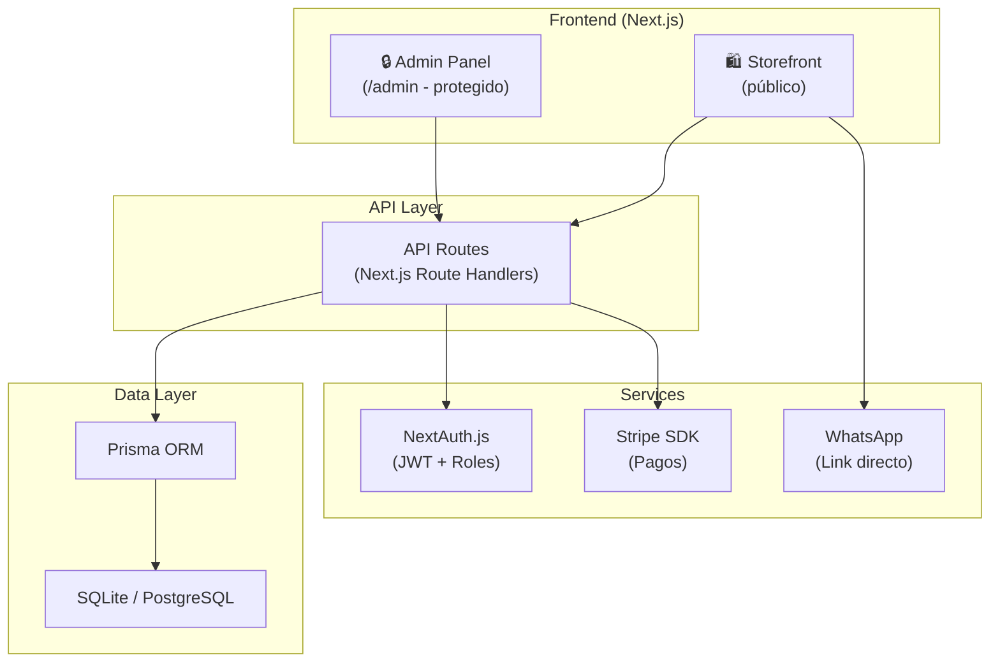
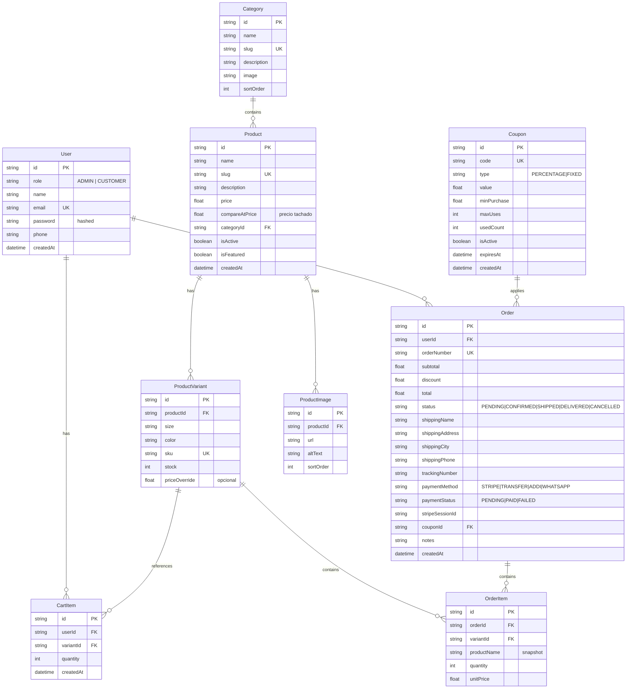
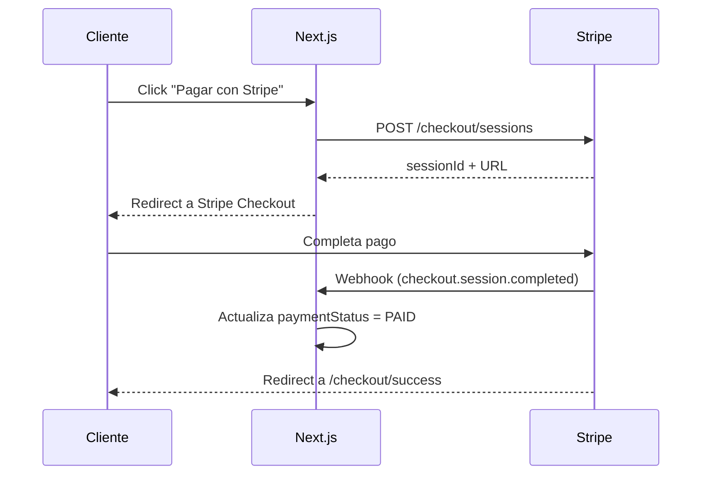

# 🎂 LilCake — E-Commerce + CRM Platform

## Resumen del Proyecto

Construir una tienda online de **ropa urbana** con CRM integrado para **LilCake**, una marca colombiana dirigida a jóvenes de 15-25 años. El sistema incluye una tienda pública (storefront) y un panel administrativo privado (CRM/admin).

---

## Análisis del Proyecto Anterior

> [!NOTE]
> Revisé tu proyecto en `Nueva carpeta (3)/ecommerce-platform`. Tiene una base funcional (Next.js 16 + Prisma + SQLite + NextAuth + Tailwind v4) pero con varias limitaciones:
> - Branding genérico ("Shopcart") — no LilCake
> - Paleta de colores corporativa (emerald/green) — no urbana/juvenil
> - Textos en inglés mezclados con español
> - WhatsApp con número placeholder
> - Sin integración Stripe
> - Sin página de login/registro funcional
> - Sin formulario de crear producto en admin
> - Sin gestión de cupones/descuentos
> - APIs sin protección de autenticación
> - Sin `@prisma/client` en dependencies (está en devDependencies — bug)

**Decisión**: Construiré el proyecto **desde cero** en el workspace limpio (`c:\Users\David\Desktop\Proyecto`), tomando las buenas ideas del proyecto anterior pero con la identidad LilCake, mejor arquitectura y todas las features requeridas.

---

## Stack Tecnológico (Justificado)

| Capa | Tecnología | Por qué |
|------|-----------|---------|
| **Framework** | Next.js 15 (App Router) | SSR, API Routes integradas, React Server Components |
| **Estilos** | Tailwind CSS v4 | Rapidez, utilidad, coherencia visual |
| **Base de datos** | SQLite (dev) → PostgreSQL (prod) | SQLite para pruebas locales inmediatas, migración trivial con Prisma |
| **ORM** | Prisma 6 | Type-safe, migraciones, introspección automática |
| **Autenticación** | NextAuth.js v4 + JWT | Sessions seguras, roles ADMIN/CUSTOMER |
| **Pagos** | Stripe Checkout | El único activo por ahora, el resto placeholder |
| **Iconos** | Lucide React | Ligero, moderno, tree-shakeable |
| **Tipografía** | Google Fonts: Space Grotesk + Inter | Urbana + legible |

---

## Diseño Visual — Identidad "LilCake" 🎂

### Paleta de Colores (Urbana & Juvenil)

| Token | Color | Uso |
|-------|-------|-----|
| `--lc-black` | `#0D0D0D` | Fondo principal, texto |
| `--lc-dark` | `#1A1A2E` | Fondo secundario, cards |
| `--lc-purple` | `#6C3CE1` | Acento primario, CTAs |
| `--lc-pink` | `#E91E8C` | Acento secundario, highlights |
| `--lc-cyan` | `#00D4FF` | Links, detalles |
| `--lc-white` | `#F5F5F7` | Texto sobre fondo oscuro |
| `--lc-gray` | `#8B8B9E` | Texto secundario |
| `--lc-success` | `#00E676` | Estados positivos |
| `--lc-warning` | `#FFB300` | Alertas |

### Estilo Visual
- **Dark mode por defecto** (la audiencia joven lo prefiere)
- Glassmorphism en cards y modales
- Gradientes sutiles (purple → pink)
- Micro-animaciones en hover y transiciones
- Tipografía gruesa y bold para headings
- Border radius grandes (16px-24px)
- Sombras con color (purple glow)

---

## Arquitectura del Sistema



---

## Modelo de Base de Datos



### Mejoras vs. Proyecto Anterior
- `ProductImage` como tabla separada (no comma-separated strings)
- `compareAtPrice` para mostrar precio original tachado
- `orderNumber` legible (ej: `LC-20260413-001`)
- `paymentStatus` separado del `status` del pedido
- `CartItem` persistido en DB para carritos abandonados
- `Coupon` table completa con expiración y límites
- Snapshots de nombre/precio en `OrderItem` (inmutabilidad)

---

## Endpoints de API

### Públicos (sin auth)
| Método | Ruta | Descripción |
|--------|------|-------------|
| GET | `/api/products` | Listar productos (filtros, search, paginación) |
| GET | `/api/products/[slug]` | Detalle de producto |
| GET | `/api/categories` | Listar categorías |
| POST | `/api/auth/register` | Registro de usuario |
| POST | `/api/auth/[...nextauth]` | Login (NextAuth) |
| POST | `/api/checkout/stripe` | Crear sesión Stripe Checkout |
| POST | `/api/webhooks/stripe` | Webhook de Stripe (confirmación) |

### Protegidos (requieren auth de CUSTOMER)
| Método | Ruta | Descripción |
|--------|------|-------------|
| GET | `/api/orders/my` | Mis pedidos |
| POST | `/api/orders` | Crear pedido |
| POST | `/api/cart` | Añadir al carrito (server) |
| GET | `/api/cart` | Obtener carrito |
| POST | `/api/coupons/validate` | Validar cupón |

### Protegidos (requieren auth ADMIN)
| Método | Ruta | Descripción |
|--------|------|-------------|
| GET/POST | `/api/admin/products` | CRUD productos |
| PUT/DELETE | `/api/admin/products/[id]` | Editar/eliminar producto |
| GET/POST | `/api/admin/categories` | CRUD categorías |
| GET | `/api/admin/orders` | Listar todos los pedidos |
| PUT | `/api/admin/orders/[id]` | Actualizar estado/tracking |
| GET | `/api/admin/customers` | Listar clientes |
| GET | `/api/admin/dashboard` | Métricas del dashboard |
| GET/POST | `/api/admin/coupons` | CRUD cupones |

### Seguridad en todos los endpoints
- Validación de inputs con Zod
- Rate limiting en auth endpoints
- CSRF protection vía SameSite cookies
- Headers de seguridad (X-Frame-Options, CSP, etc.)
- Admin routes verifican `role === "ADMIN"` en JWT

---

## Estructura de Carpetas

```
c:\Users\David\Desktop\Proyecto\
├── prisma/
│   ├── schema.prisma
│   └── seed.ts                    # Seed con admin user + categorías
├── public/
│   └── images/                    # Imágenes estáticas
├── src/
│   ├── app/
│   │   ├── layout.tsx             # Root layout (fonts, metadata)
│   │   ├── globals.css            # Design system completo
│   │   ├── (storefront)/          # Route group: tienda pública
│   │   │   ├── layout.tsx         # Navbar + Footer + WhatsApp CTA
│   │   │   ├── page.tsx           # Homepage (hero + featured)
│   │   │   ├── productos/
│   │   │   │   ├── page.tsx       # Catálogo con filtros
│   │   │   │   └── [slug]/
│   │   │   │       └── page.tsx   # Detalle de producto
│   │   │   ├── carrito/
│   │   │   │   └── page.tsx       # Carrito de compras
│   │   │   ├── checkout/
│   │   │   │   └── page.tsx       # Checkout (formulario + resumen)
│   │   │   ├── cuenta/
│   │   │   │   └── page.tsx       # Mi cuenta + historial
│   │   │   └── login/
│   │   │       └── page.tsx       # Login + Registro
│   │   ├── admin/                 # Panel administrativo
│   │   │   ├── layout.tsx         # Sidebar + protección de ruta
│   │   │   ├── page.tsx           # Dashboard con métricas
│   │   │   ├── productos/
│   │   │   │   ├── page.tsx       # Lista de productos
│   │   │   │   └── nuevo/
│   │   │   │       └── page.tsx   # Formulario crear/editar
│   │   │   ├── pedidos/
│   │   │   │   └── page.tsx       # Lista + gestión de pedidos
│   │   │   ├── clientes/
│   │   │   │   └── page.tsx       # Lista de clientes
│   │   │   └── cupones/
│   │   │       └── page.tsx       # Gestión de cupones
│   │   └── api/
│   │       ├── auth/
│   │       │   ├── [...nextauth]/route.ts
│   │       │   └── register/route.ts
│   │       ├── products/
│   │       │   ├── route.ts
│   │       │   └── [slug]/route.ts
│   │       ├── categories/route.ts
│   │       ├── cart/route.ts
│   │       ├── orders/
│   │       │   ├── route.ts
│   │       │   └── my/route.ts
│   │       ├── coupons/
│   │       │   └── validate/route.ts
│   │       ├── checkout/
│   │       │   └── stripe/route.ts
│   │       ├── webhooks/
│   │       │   └── stripe/route.ts
│   │       └── admin/
│   │           ├── products/
│   │           │   ├── route.ts
│   │           │   └── [id]/route.ts
│   │           ├── categories/route.ts
│   │           ├── orders/
│   │           │   ├── route.ts
│   │           │   └── [id]/route.ts
│   │           ├── customers/route.ts
│   │           ├── coupons/route.ts
│   │           └── dashboard/route.ts
│   ├── components/
│   │   ├── ui/                    # Componentes base reutilizables
│   │   │   ├── Button.tsx
│   │   │   ├── Input.tsx
│   │   │   ├── Badge.tsx
│   │   │   ├── Card.tsx
│   │   │   └── Modal.tsx
│   │   ├── storefront/
│   │   │   ├── Navbar.tsx
│   │   │   ├── Footer.tsx
│   │   │   ├── ProductCard.tsx
│   │   │   ├── ProductFilters.tsx
│   │   │   ├── HeroSection.tsx
│   │   │   ├── WhatsAppButton.tsx
│   │   │   └── CartDrawer.tsx
│   │   └── admin/
│   │       ├── Sidebar.tsx
│   │       ├── StatsCard.tsx
│   │       ├── ProductForm.tsx
│   │       ├── OrderTable.tsx
│   │       └── AdminGuard.tsx      # Protección client-side
│   ├── lib/
│   │   ├── prisma.ts
│   │   ├── auth.ts
│   │   ├── stripe.ts
│   │   ├── utils.ts               # Formateo COP, helpers
│   │   └── validations.ts         # Schemas Zod
│   └── types/
│       └── index.ts               # TypeScript types globales
├── .env.example
├── .gitignore
├── package.json
├── tsconfig.json
├── next.config.ts
└── postcss.config.mjs
```

---

## Wireframe Textual

### Homepage (Storefront)
```
┌─────────────────────────────────────────────────┐
│ 🎂 LilCake    [Categorías] [Buscar...] 👤 🛒  │
├─────────────────────────────────────────────────┤
│                                                 │
│  ╔═══════════════════════════════════════════╗  │
│  ║  HERO BANNER                             ║  │
│  ║  "TU ESTILO, TU REGLA"                  ║  │
│  ║  Descubre la nueva colección urbana      ║  │
│  ║           [VER COLECCIÓN]                ║  │
│  ╚═══════════════════════════════════════════╝  │
│                                                 │
│  ── CATEGORÍAS ────────────────────────────     │
│  [🧥 Ropa]  [👟 Zapatos]  [💎 Accesorios]     │
│                                                 │
│  ── PRODUCTOS DESTACADOS ──────────────────     │
│  ┌─────┐ ┌─────┐ ┌─────┐ ┌─────┐              │
│  │ img │ │ img │ │ img │ │ img │              │
│  │name │ │name │ │name │ │name │              │
│  │$$$  │ │$$$  │ │$$$  │ │$$$  │              │
│  └─────┘ └─────┘ └─────┘ └─────┘              │
│                                                 │
│  ── FOOTER ────────────────────────────────     │
│  LilCake | Instagram | WhatsApp | © 2026       │
└─────────────────────────────────────────────────┘
                                        💬 WhatsApp
```

### Admin Dashboard
```
┌──────────┬──────────────────────────────────────┐
│ LilCake  │                                      │
│ Admin    │  📊 Dashboard                        │
│          │                                      │
│ 📊 Dash  │  ┌──────┐ ┌──────┐ ┌──────┐ ┌──────┐│
│ 📦 Prods │  │Ventas│ │Pedid.│ │Prods │ │Users ││
│ 🛒 Orden │  │$2.3M │ │  47  │ │  85  │ │ 234  ││
│ 👥 Clien │  └──────┘ └──────┘ └──────┘ └──────┘│
│ 🎫 Cupon │                                      │
│          │  [Gráfico de ventas placeholder]      │
│          │                                      │
│ ──────── │  Pedidos Recientes                    │
│ 🚪 Salir │  ┌────────────────────────────────┐  │
│          │  │ #LC-001 | Juan | $89.000 |PEND│  │
│          │  │ #LC-002 | Ana  | $145.000|PAID│  │
│          │  └────────────────────────────────┘  │
└──────────┴──────────────────────────────────────┘
```

---

## Integración Stripe — Paso a Paso

### 1. Crear cuenta en Stripe
- Ir a [stripe.com](https://stripe.com) → Registrarse
- Completar verificación (se puede usar en modo test sin verificar)

### 2. Obtener claves API
- Dashboard → Developers → API Keys
- Copiar `STRIPE_SECRET_KEY` (sk_test_...)
- Copiar `STRIPE_PUBLISHABLE_KEY` (pk_test_...)
- Crear webhook → copiar `STRIPE_WEBHOOK_SECRET`

### 3. Flujo de pago implementado


### 4. Variables de entorno
```env
STRIPE_SECRET_KEY=sk_test_...
STRIPE_PUBLISHABLE_KEY=pk_test_...
STRIPE_WEBHOOK_SECRET=whsec_...
```

---

## Fases de Ejecución

### Fase 1: Fundación (~20 archivos)
1. Inicializar proyecto Next.js con Tailwind v4
2. Configurar Prisma + schema completo + seed
3. Design system completo en `globals.css`
4. Componentes UI base (Button, Input, Card, Badge, Modal)
5. Auth (NextAuth + login + registro)
6. Middleware de protección admin

### Fase 2: Storefront (~12 archivos)
7. Layout storefront (Navbar + Footer + WhatsApp)
8. Homepage con Hero + categorías + productos destacados
9. Catálogo con filtros y búsqueda
10. Página de detalle de producto
11. Carrito de compras
12. Checkout con integración Stripe

### Fase 3: Admin Panel (~10 archivos)
13. Layout admin con sidebar
14. Dashboard con métricas
15. CRUD de productos con formulario completo
16. Gestión de pedidos (tabla + actualización de estado)
17. Lista de clientes
18. Gestión de cupones

### Fase 4: API Layer (~15 archivos)
19. API de productos (público + admin)
20. API de categorías
21. API de pedidos
22. API de carrito
23. API de cupones (validación + CRUD)
24. Stripe checkout + webhook
25. API de dashboard/métricas

### Fase 5: Seguridad y Polish
26. Validación Zod en todos los endpoints
27. Rate limiting en auth
28. Headers de seguridad
29. Protección admin middleware
30. Error handling global

---

## User Review Required

> [!IMPORTANT]
> **Decisiones que necesitan tu aprobación:**
> 1. **Dark mode por defecto** — ¿Te gusta para la vibe urbana? ¿O prefieres light mode?
> 2. **Paleta púrpura/rosa/cyan** — ¿Va con tu visión de LilCake? ¿Tienes otros colores en mente?
> 3. **SQLite para desarrollo** — Permite arrancar sin instalar PostgreSQL. ¿OK?
> 4. **Tailwind CSS v4** — Tu proyecto anterior lo usaba. ¿Confirmas o prefieres CSS vanilla?

> [!WARNING]
> **Alcance del proyecto:** Este es un sistema completo con ~60+ archivos. La generación será incremental por fases. Las primeras fases serán la base funcional; las últimas agregarán polish y seguridad avanzada.

---

## Verification Plan

### Automated Tests
- `npx prisma db push` — verificar que el schema es válido
- `npx prisma db seed` — verificar que el seed crea datos correctamente
- `npm run build` — verificar que compila sin errores
- `npm run dev` — verificar que funciona en localhost:3000

### Manual Verification (Browser)
- Navegar la tienda pública y verificar diseño responsive
- Probar flujo completo: ver producto → agregar al carrito → checkout
- Verificar que /admin no es accesible sin login
- Login como admin y verificar dashboard + CRUD
- Probar botón de WhatsApp con número correcto
- Verificar Stripe en modo test

---

## Guía de Despliegue (Post-desarrollo)

| Servicio | Uso | Costo aprox. |
|----------|-----|-------------|
| **Vercel** | Frontend + API Routes | Gratis (hobby) |
| **Railway / Neon** | PostgreSQL en producción | Gratis tier disponible |
| **Stripe** | Pagos | 2.9% + $0.30 por transacción |
| **Cloudinary** | Imágenes de productos | Gratis hasta 25GB |

### Pasos de deploy:
1. Push a GitHub
2. Conectar repo a Vercel
3. Configurar variables de entorno en Vercel
4. Cambiar `DATABASE_URL` de SQLite a PostgreSQL
5. `npx prisma migrate deploy`
6. Configurar Stripe webhook apuntando a tu dominio

---

## Buenas Prácticas Implementadas

- ✅ Server Components por defecto, Client Components solo cuando necesario
- ✅ Validación de datos en backend con Zod
- ✅ Passwords hasheados con bcrypt
- ✅ JWT con roles para autorización
- ✅ Variables sensibles en `.env` (nunca en código)
- ✅ CSRF protection vía SameSite cookies
- ✅ Input sanitización contra XSS
- ✅ Queries parametrizadas vía Prisma (anti SQL injection)
- ✅ Rate limiting en endpoints de auth
- ✅ Middleware para proteger rutas admin
- ✅ Código modular y componentes reutilizables
- ✅ TypeScript strict mode
- ✅ Responsive design (mobile-first)
- ✅ SEO optimizado (meta tags, semantic HTML)
- ✅ Precios en COP formateados correctamente
