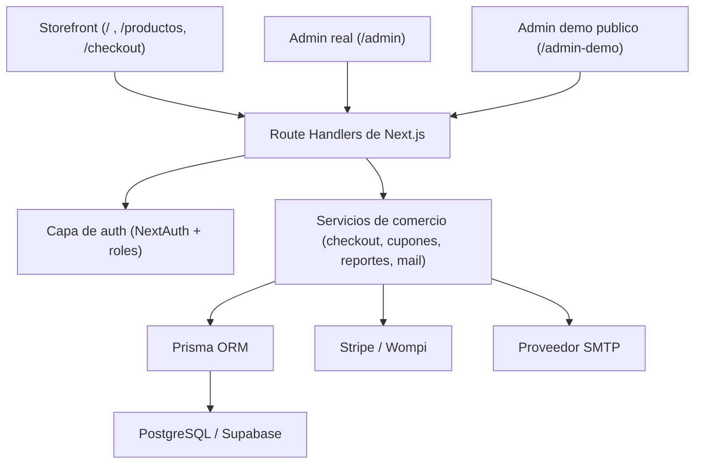

# Guía Técnica de LilCake

Si buscas la presentación del producto, revisa [README.md](./README.md) o [README.es.md](./README.es.md).
Si quieres esta guía técnica en inglés, revisa [README.dev.md](./README.dev.md).

LilCake es una tienda construida con Next.js que incluye:

- Next.js App Router
- NextAuth con credenciales y Google OAuth
- Prisma ORM
- Flujos de checkout con Stripe, Wompi y WhatsApp para contraentrega/asesor
- Panel administrativo para catalogo, imagenes, pedidos, cupones, clientes y reportes

[Read this technical guide in English](./README.dev.md)

## Estructura de documentacion

- `README.md`: presentacion comercial en ingles
- `README.es.md`: presentacion comercial en espanol
- `README.dev.md`: guia tecnica para desarrollo en ingles
- `README.dev.es.md`: guia tecnica para desarrollo en espanol

## Admin demo y seguridad del admin real

- `/admin-demo` es publico a proposito para que cualquier visitante pueda explorar la experiencia administrativa sin credenciales.
- El demo nunca escribe en la base real y evita por diseno los endpoints reales de escritura del admin.
- El admin real sigue separado y protegido con:
  - control de acceso por roles en servidor
  - rutas `/admin` protegidas
  - endpoints `/api/admin/*` protegidos
  - autenticacion respaldada por secreto de sesion
  - rate limits sobre acciones sensibles
  - validacion backend y errores publicos sanitizados

## Resumen del stack

| Capa | Opcion actual | Proposito |
| --- | --- | --- |
| Framework | Next.js 16 App Router | Storefront, panel admin, rutas API, SSR y RSC |
| UI | Tailwind CSS v4 + Lucide React | Interfaz oscura coherente para tienda y dashboard |
| Base de datos | PostgreSQL (Supabase) | Persistencia productiva de usuarios, productos, pedidos, cupones y reportes |
| ORM | Prisma 6 | Consultas tipadas, schema, migraciones e indices |
| Auth | NextAuth + credenciales + Google OAuth | Acceso por roles, login de clientes y proteccion del admin |
| Pagos | Stripe Checkout + Wompi Colombia + fallback por WhatsApp | Flujo real de pago con cierre seguro de ordenes, Wompi para pagos electronicos y asesor para contraentrega/Addi |
| Correos | SMTP mailer | Verificacion, recuperacion, notificaciones de pedido y envio |
| Reportes | ExcelJS + pdf-lib | Exportaciones operativas de ventas, pedidos y clientes |
| Deploy | Vercel | Hosting productivo, variables de entorno y rutas listas para webhooks |

## Arquitectura de ejecucion



## Modelo funcional del dominio

| Dominio | Modelos principales | Responsabilidad |
| --- | --- | --- |
| Identidad | `User`, `Account`, `Session`, `AccountSecurityToken` | Credenciales, Google OAuth, sesiones, verificacion y recuperacion |
| Catalogo | `Category`, `Product`, `ProductImage`, `ProductVariant` | Organizacion de productos, galeria ordenable, stock y SKUs |
| Carrito | `CartItem` | Carrito autenticado persistido con sincronizacion mas segura |
| Pedidos | `Order`, `OrderItem`, `PaymentTransaction` | Snapshots de checkout, totales, envio, estado de pago y trazabilidad multipasarela |
| Promociones | `Coupon`, `CouponCustomerUsage` | Control de descuentos globales y por cliente desde backend |
| Operacion | servicios de reportes/exportacion + correos transaccionales | Reportes, comunicacion con clientes, envios y visibilidad del negocio |

## Resumen de APIs

| Acceso | Rutas ejemplo | Uso |
| --- | --- | --- |
| Publico | `/api/products`, `/api/categories`, `/api/auth/register`, `/api/checkout/stripe`, `/api/checkout/wompi`, `/api/webhooks/stripe`, `/api/webhooks/wompi` | Lecturas del storefront, entrada de auth, bootstrap de checkout y webhooks de pasarelas |
| Cliente autenticado | `/api/cart/sync`, `/api/orders/[id]/resume`, `/api/orders/[id]/cancel`, `/api/checkout/coupon` | Sync del carrito, reintento/cancelacion de pedidos y vista previa de cupones |
| Admin protegido | `/api/admin/products`, `/api/admin/orders/[id]`, `/api/admin/coupons`, `/api/admin/reports/export` | Operacion de catalogo, pedidos, cupones y reportes bajo checks de admin |

## Referencia de desarrollo migrada desde notas locales

- La informacion tecnica reutilizable que antes vivia en `CLAUDE.md` se concentro aqui para mantener una referencia de desarrollo util sin exponer ese archivo local.
- `CLAUDE.md` puede quedarse como nota privada en la maquina, pero ya no hace falta como documento versionado del proyecto.

## Historial de cambios

### 2026-05-10

- Se completo una pasada visual solo de storefront, sin cambiar rutas backend, modelos Prisma, servicios de checkout, auth ni integraciones de pago.
- Se actualizo el hero de inicio para usar un asset local mas fuerte de tienda/sneakers, se movio el carrusel cliente de productos destacados a la seccion de confianza/lookbook, y la lectura de productos destacados ahora pide dos imagenes ordenadas, activando el crossfade en hover cuando un producto tiene segunda imagen en galeria.
- Se recuperaron acentos controlados de color LilCake en el wordmark, CTA de WhatsApp e iconos sociales del footer sin cambiar comportamiento backend.
- El sistema visual de la tienda se movio hacia una direccion retail oscura y mas sobria:
  - superficies charcoal, bordes mas finos y acento LilCake mas controlado
  - menos glow, glass, gradientes, radios grandes y movimiento decorativo
  - hero, cards de producto, controles de catalogo, detalle de producto, carrito, ayuda, auth y tarjetas compartidas mas limpios
  - ordenamiento de catalogo en cliente sobre la respuesta existente del API de productos

### 2026-05-05

- Se reforzo la superficie de APIs de pagos y carrito despues de una revision de seguridad:
  - las URLs de retorno de Stripe y Wompi ahora usan el origen confiable configurado de la app, en vez de derivar redirecciones desde el host entrante del request
  - checkout, vista previa de cupon y sync de carrito ahora limitan cantidad de items, cantidades por item y largos de texto antes de tocar Prisma
  - el sync de carrito filtra variantes enviadas contra productos activos antes de escribir, evitando variantes invalidas y filas viejas
  - creacion, reintento y cancelacion de pedidos comparten rate limits por usuario/IP para reducir abuso de ordenes y sesiones de pago
  - Google OAuth ya no auto-vincula cuentas solo por coincidencia de email, reduciendo riesgo de pre-hijacking en registros con correo no verificado
  - `next-auth` se subio a `4.24.14`, y PostCSS queda forzado a la version parchada `8.5.14` en instalaciones directas y transitivas
  - `npm audit` aun reporta el advisory upstream de `next-auth`/`nodemailer` porque `next-auth` todavia declara peer sobre Nodemailer 7; la app no pasa opciones `name` ni `envelope.size` controladas por usuario a Nodemailer
- Se pulieron las tarjetas del historial de pedidos del cliente sin cambiar checkout, pagos, auth ni base de datos:
  - la tarjeta ahora usa una grilla responsive para alinear mejor datos del pedido, badges, total y boton de accion en movil y escritorio
  - los badges de pago usan un helper compartido y evitan texto repetido, manteniendo claros los estados pendiente y fallido
  - el mismo texto de badge de pago se reutiliza en los headers de detalle de pedido de cliente, admin real y admin-demo

### 2026-05-04

- Se completo el rollout productivo de Wompi sin versionar credenciales:
  - los valores live de Wompi quedan configurados solo como variables de entorno de Produccion en Vercel
  - `NEXT_PUBLIC_WOMPI_ENABLED=true` se redesplego para que el bundle estatico de checkout muestre la opcion Wompi
  - `WOMPI_ENVIRONMENT=production` queda activo para llamadas Wompi del lado servidor
  - el endpoint de salud del webhook Wompi se verifico como configurado en produccion
  - `/api/checkout/wompi` ahora llega al guard de checkout autenticado en vez de responder como proveedor deshabilitado
  - `.vercelignore` ahora evita que cualquier archivo `.env*` entre al paquete subido a Vercel
  - se revisaron HTML y chunks JS de produccion para descartar marcadores de secretos server-side de Wompi
- Se implementaron notas de venta PDF como comprobantes internos no fiscales:
  - `src/lib/sales-note.ts` centraliza la generacion del PDF, numeracion `NV-{orderNumber}`, datos de negocio por variables de entorno y aviso de no reemplazo de factura electronica DIAN
  - `/api/admin/orders/[id]/sales-note` permite al admin real descargar la nota del pedido con guard de rol administrativo
  - `/api/orders/[id]/sales-note` permite al cliente descargar solo sus propios comprobantes autenticados
  - `/api/admin-demo/orders/[id]/sales-note` genera comprobantes de muestra para el sandbox publico sin tocar datos reales
  - los correos de confirmacion y envio adjuntan automaticamente la nota de venta del pedido cuando se disparan
  - el PDF se genera desde el snapshot actual de `Order` y `OrderItem`, sin crear tablas adicionales por comprobante
- Se agrego configuracion editable del negocio desde el panel administrativo:
  - nuevo modelo Prisma `BusinessSettings` y migracion `20260504100000_add_business_settings`
  - nueva ruta protegida `/api/admin/business-settings` con guard administrativo y validacion Zod
  - nueva pagina `/admin/configuracion` para editar datos comerciales usados por las notas de venta
  - nueva pagina `/admin-demo/configuracion` con el mismo flujo en modo sandbox sin escritura real
  - `src/lib/business-settings.ts` centraliza defaults, lectura segura, guardado y datos mock del demo
  - la generacion de notas de venta ahora lee primero la configuracion de base de datos y solo usa variables de entorno como respaldo

### 2026-05-03

- Se agrego ordenamiento de imagenes de producto en el admin real y en el admin demo publico:
  - `ProductForm` ahora permite subir o bajar imagenes dentro de la galeria, manteniendo la accion de portada y la accion de eliminar
  - el orden se conserva en el arreglo enviado por el formulario y sigue usando el campo existente `ProductImage.sortOrder`, por lo que no hizo falta una migracion de schema
  - `/api/admin/products` y `/api/admin/products/[id]` ahora devuelven imagenes ordenadas por `sortOrder` despues de listar, crear y actualizar productos
  - los productos semilla de `/admin-demo` ahora incluyen galerias con varias imagenes para probar orden y portada de forma segura
  - las ediciones demo conservan el orden simulado sin llamar endpoints reales de escritura ni tocar PostgreSQL
- Se pulió el storefront después de la mejora de animaciones:
  - se corrigieron textos visibles con tildes, eñes y signos de apertura en home, catálogo, carrito, checkout, cuenta, registro, login, detalle de producto y página 404
  - la sección `Experiencia LilCake` ahora incluye imagen editorial, CTA hacia catálogo, acceso rápido a ropa y copy más claro
  - se corrigió la navegación de categorías para que la barra superior y la barra lateral del catálogo se sincronicen correctamente con `?categoria=...`
  - `Navbar` ahora lee `useSearchParams` dentro de límites `Suspense` para mantener el build estático de páginas como `/ayuda` y `/_not-found`
  - se verificó responsive en móvil, tablet y escritorio sin overflow horizontal
- Se mejoro la experiencia visual de la pagina principal sin tocar backend ni flujo de compra:
  - se agrego `ScrollReveal` con `IntersectionObserver` para animaciones por scroll ligeras y reutilizables
  - se instalo `motion` para animaciones React mas expresivas en la seccion de experiencia de la home
  - el hero ahora tiene capas de brillo, grilla sutil, elementos flotantes y efecto shine en el CTA principal
  - productos destacados y categorias aparecen con revelado escalonado para una sensacion mas profesional y vendible
  - se redisenó la seccion narrativa de experiencia LilCake con tarjetas mas coloridas, iconos, brillos animados y hover premium
  - las animaciones respetan `prefers-reduced-motion` para accesibilidad
- Se preparo la integracion segura de Wompi Colombia sin reemplazar Stripe:
  - se agrego el modelo `PaymentTransaction` para registrar intentos de pago por proveedor, referencia, estado, metodo usado, monto en centavos y payload de auditoria
  - el checkout ahora puede crear pagos Wompi con referencia unica, monto calculado desde backend y firma de integridad generada en servidor
  - se anadio `/api/webhooks/wompi` para recibir `transaction.updated`, validar checksum dinamico y finalizar ordenes solo cuando Wompi confirme `APPROVED`
  - se anadio `/api/checkout/wompi` para iniciar pagos y consultar el estado de regreso sin confiar en datos del frontend
  - los reintentos de pedidos pendientes ahora contemplan `WOMPI`, igual que Stripe y WhatsApp
  - el admin muestra trazabilidad de transacciones asociadas al pedido y los reportes usan etiquetas legibles de metodo de pago
  - `NEXT_PUBLIC_WOMPI_ENABLED` queda como feature flag para mantener Wompi oculto hasta validar Vercel y sandbox
- Se corrigio el retorno del checkout despues de pagos con Stripe/Wompi:
  - la pantalla de confirmacion ya no queda "pegada" al volver a `/checkout` para una compra nueva
  - el carrito ya no se limpia solo por visitar una URL antigua con parametros de retorno de pago
  - despues de confirmar un pago se limpia la URL visible para evitar reutilizar `session_id` o `id` de Wompi en la siguiente navegacion
- Se mejoro la presentacion de metodos de pago en checkout:
  - Wompi queda como primera opcion y seleccionado por defecto cuando esta activo
  - los metodos muestran logos reales guardados localmente para Wompi, PSE, Bancolombia, Davivienda, Nequi, Visa, Mastercard, Stripe, Amex, WhatsApp y Addi, mas chips de texto para opciones asistidas sin marca
  - el fallback `WHATSAPP` dejo de presentarse como transferencia y ahora comunica contraentrega u otros metodos coordinados con asesor

### 2026-04-25

- Se mejoro la experiencia responsive en el storefront, el admin real y el admin demo publico sin cambiar el comportamiento del backend:
  - la tienda ahora usa mejores espaciados moviles, una grilla de productos mas equilibrada y layouts mas comodos al tacto en carrito, checkout, navbar y detalle de producto
  - las cards de producto, la galeria y los CTA de compra se ajustaron para que la experiencia movil se sienta mas pulida y menos como un desktop comprimido
  - el admin real y `/admin-demo` ahora comparten un shell movil con navegacion tipo drawer, en lugar de forzar la sidebar de escritorio en pantallas pequenas
  - productos, pedidos, clientes y cupones ahora muestran tarjetas en movil mientras conservan las tablas en desktop
  - el formulario de producto, el detalle de pedido, las acciones de exportacion y los controles de estado se reorganizaron para apilarse mejor en telefonos y tablets pequenas
  - estos cambios se limitaron a frontend y experiencia de uso, por lo que no se alteraron la logica de backend, auth, pagos ni base de datos

### 2026-04-23

- Se corrigieron las subidas de imagenes de productos en produccion sobre Vercel:
  - en local, si no existe token de Blob, las subidas siguen guardandose en `public/uploads/products`
  - en produccion, las subidas usan Vercel Blob cuando `BLOB_READ_WRITE_TOKEN` esta configurado
  - los deployments de Vercel ya no dependen de escribir imagenes en el filesystem serverless
  - el formulario admin mantiene el mismo flujo y el backend elige automaticamente el proveedor correcto
  - se reforzo la deteccion de archivos multipart en el runtime de Vercel para evitar rechazos por checks fragiles con `instanceof File`
  - el selector del admin ahora limita los formatos a los que valida el backend: JPG, PNG, WEBP, GIF y AVIF
  - en produccion, las imagenes ahora suben directo a Vercel Blob con un token temporal solo para admins, evitando los limites de tamano del body en Vercel Functions para fotos mas pesadas
  - se actualizo la politica CSP para permitir subidas directas desde el navegador hacia los endpoints de Vercel Blob

### 2026-04-22

- Se separo el desarrollo local de la schema de base usada por Vercel:
  - `localhost` ahora usa una schema dedicada de PostgreSQL/Supabase a traves de `.env.local`
  - `npm run dev` y los scripts locales de Prisma ahora bloquean automaticamente conexiones a la schema remota `public`
  - se anadio `npm run db:local:setup` para preparar la schema local, sincronizar Prisma y ejecutar el seed sin tocar produccion
  - `prisma.config.ts` ahora carga `.env.local`, asi que Next.js y Prisma CLI comparten el mismo entorno local seguro
- Se corrigio el formulario de productos del admin para que no vuelva a pisar lo escrito:
  - las vistas de crear y editar ahora precargan categorias y producto desde el servidor
  - el formulario deja de rehidratarse despues de montar cuando ya trae datos iniciales, evitando campos que parecen bloqueados o valores que se revierten mientras escribes

- Se movio la referencia tecnica reutilizable de `CLAUDE.md` hacia las guias de desarrollo:
  - se anadieron un resumen del stack, un mapa de arquitectura, un resumen del dominio y una vista general de APIs
  - la informacion util de desarrollo ahora vive en `README.dev.md` y `README.dev.es.md`
  - `CLAUDE.md` quedo preparado para mantenerse solo de forma local y no como documento versionado del proyecto

- Se anadio un sandbox publico `admin-demo` totalmente separado del admin real:
  - `/admin-demo` ahora expone la UI administrativa con datos demo y acciones simuladas
  - crear, editar, eliminar, exportar y cambiar estados muestra feedback de demo en lugar de escribir en PostgreSQL
  - el demo usa mocks dedicados y evita a proposito los endpoints reales de escritura del admin
  - un banner fijo deja claro que el entorno es solo de evaluacion y que no persiste cambios
- Se aclaro la proteccion de rutas para que el demo sea publico sin abrir el admin real:
  - la proteccion ahora apunta de forma precisa a `/admin` y `/api/admin/*`, sin capturar `/admin-demo`
  - el admin real sigue dependiendo de control por roles, guards del lado del servidor, APIs administrativas protegidas, secretos de sesion, rate limits y validacion backend
- Se separo con mas claridad la documentacion comercial y la tecnica:
  - `README.md` y `README.es.md` ahora funcionan como entrada comercial/orientada a producto
  - `README.dev.md` y `README.dev.es.md` conservan el setup tecnico, la operacion y el historial de cambios
  - los README de venta ahora resaltan el live demo, el admin demo, el comportamiento sandbox y el contexto de evaluacion para visitantes externos

- Se reemplazo el placeholder de "analiticas detalladas" del dashboard admin por un centro real de exportacion:
  - el panel ahora permite exportar `sales`, `orders` y `customers`
  - los reportes pueden filtrarse por `today`, `last 7 days`, `last 30 days`, `this month` o un rango personalizado
  - el panel muestra metricas en vivo, una tabla previa y acciones directas de exportacion
- Se anadieron endpoints administrativos seguros para reportes:
  - `GET /api/admin/reports/summary` devuelve el resumen y la vista previa del rango seleccionado
  - `GET /api/admin/reports/export` genera el archivo final en `xlsx` o `pdf`
  - todos los calculos salen de PostgreSQL/Prisma del lado del servidor, no de totales armados en frontend
- Se anadieron exportaciones reales de negocio en Excel y PDF:
  - el Excel ahora incluye una hoja de resumen ejecutivo mas clara y otra hoja con los datos completos
  - el PDF mantiene el look de marca de LilCake, pero orientado a uso operativo y administrativo
  - la misma capa de reportes ahora soporta ventas, pedidos y actividad de clientes
- Se corrigieron las primeras regresiones del centro de exportacion:
  - la exportacion ahora siempre envia un formato valido, por lo que ya no falla con el mensaje de formato invalido
  - el efecto del panel admin se estabilizo para evitar el error de React/Turbopack al cambiar filtros
  - la hoja `Resumen` del Excel se rehizo para ganar contraste y legibilidad
  - el espaciado de la tabla del PDF se ajusto para que la primera fila no quede visualmente cortada bajo la cabecera
- Se mejoraron los campos de contraseña en toda la app:
  - los inputs compartidos de contraseña ahora incluyen un toggle para mostrar u ocultar la clave con un icono de ojo
  - esto aplica al login de cliente, registro, restablecimiento de contraseña y login de admin
  - el control es accesible con teclado y no tapa el texto ingresado
- Se completo el primer despliegue productivo en Vercel:
  - el proyecto ya quedo publicado en `https://lilcake.vercel.app`
  - se configuraron variables de produccion para PostgreSQL, autenticacion, correo, Google OAuth, WhatsApp y Stripe en modo test
  - se creo el webhook de Stripe para `https://lilcake.vercel.app/api/webhooks/stripe`
  - se validaron rutas publicas con datos reales desde Vercel y tambien la conexion directa Prisma/PostgreSQL contra Supabase
  - se anadio `.vercelignore` para que futuros despliegues no suban archivos locales de entorno ni artefactos innecesarios

### 2026-04-21

- Se anadio consentimiento legal obligatorio para registro y checkout:
  - el registro con correo y contrasena ahora exige aceptar terminos y politica de privacidad
  - la creacion de cuenta con Google tambien queda protegida del lado del servidor si no hubo consentimiento previo
  - el checkout ahora obliga a aceptar los documentos legales antes de crear cualquier orden con Stripe, Wompi o WhatsApp
  - el backend rechaza intentos de saltarse ese checkbox manipulando el frontend
- Se mejoro la confiabilidad del cierre de pago con Stripe:
  - el endpoint de regreso desde Stripe ahora puede finalizar la orden de forma segura si Stripe ya marco la sesion como pagada pero el webhook local todavia no entro
  - la finalizacion de la orden ahora usa un lock de fila en base de datos para evitar descuentos dobles de stock si el webhook y el retorno compiten al mismo tiempo
- Se ampliaron los datos logistico-comerciales de las ordenes:
  - las ordenes ahora guardan `customerEmail`, `shippingCarrier`, `trackingNumber`, `confirmedAt`, `shippedAt` y marcas de tiempo de correos enviados
  - el detalle de pedido en admin ahora muestra un bloque dedicado a envio/seguimiento y constancia de correos enviados al cliente
  - el detalle del pedido en cuenta de cliente ahora muestra mejor la informacion de transportadora, guia y tiempos de confirmacion/envio
  - la lista de pedidos del cliente ahora puede mostrar la guia de envio directamente cuando exista
- Se anadieron reglas operativas reales para envios desde admin:
  - el formulario administrativo del pedido ahora captura `shippingCarrier` y `trackingNumber`
  - un pedido no puede marcarse como enviado si no tiene transportadora y numero de guia
  - la busqueda de pedidos en admin ahora encuentra resultados por guia y transportadora
- Se anadieron correos transaccionales de pedidos:
- los pedidos por WhatsApp/contraentrega envian un correo de “pedido recibido” al crearse
  - los pedidos confirmados o pagados envian un correo de “pedido confirmado”
  - los pedidos enviados mandan automaticamente un correo de “pedido enviado” con transportadora y guia
  - la orden guarda la fecha exacta de cada correo enviado para auditoria y soporte
  - el mismo sistema visual de correos de marca ahora cubre seguridad de cuenta y notificaciones de pedidos

### 2026-04-20

- Se anadio un sistema real de cupones conectado al checkout y al admin:
  - los cupones ahora se pueden crear, editar, activar, desactivar y eliminar desde el panel
  - el checkout solo envia el `couponCode`; toda la validacion y el calculo del descuento viven en backend
  - las ordenes ahora guardan subtotal, descuento, total y referencia del cupon
  - el uso del cupon se reserva dentro de una transaccion al crear la orden pendiente y se libera si esa orden falla o se cancela antes de pagarse
  - Stripe ahora recibe el descuento aprobado por backend para que el monto cobrado coincida con el total real de la orden
- Se anadieron limites duales para cupones:
  - limite global de uso entre todos los clientes
  - limite por cliente para un mismo cupon
  - una tabla `CouponCustomerUsage` ahora registra de forma segura el uso por usuario
  - el panel admin ya muestra por separado el restante global y la regla por cliente
- Se mejoro la experiencia del admin para cupones:
  - crear o editar cupon ya no ocurre en un panel apretado, sino en una ventana modal dedicada
  - el formulario explica mejor la diferencia entre limite global y limite por cliente
  - los cupones agotados ahora se marcan como `Agotado`
- Se mejoro la comodidad del checkout:
  - los campos de envio usan metadatos reales de autocompletado del navegador
  - el cliente puede elegir recordar sus datos de envio en este navegador para futuras compras
  - el checkout vuelve a cargar datos guardados localmente y datos basicos del perfil autenticado si existen
  - el detalle de producto ahora permite checkout directo de un solo item desde Comprar ahora sin reemplazar el flujo normal del carrito
- Se reforzo la seguridad de cuenta:
  - la politica de contrasena exige mayuscula, minuscula, numero, simbolo y confirmacion
  - los usuarios pueden crear o cambiar contrasena desde el area de cuenta
  - los cambios de contrasena ahora pasan por enlaces verificados y tokens temporales
- Se anadieron flujos de verificacion de correo y recuperacion de contrasena:
  - correos de verificacion
  - flujo de olvide mi contrasena
  - pagina de restablecimiento con token temporal
- Se anadio soporte SMTP con correos de marca y guia para Gmail en desarrollo local
- Se documento en detalle toda la configuracion de seguridad y correo en los README
- Se anadio una experiencia de busqueda real en el storefront:
  - el icono de busqueda del navbar ahora abre un panel lateral
  - la busqueda de productos se activa a partir de 3 letras
  - la pagina de catalogo ahora refina resultados en vivo mientras escribes
  - la relevancia compartida de resultados se movio a `src/lib/product-search.ts`
- Se anadio busqueda dinamica en las tablas del admin para productos, pedidos y clientes:
  - nuevo input reutilizable de busqueda administrativa
  - filtrado instantaneo sobre los datos ya cargados en cada tabla
  - contadores de coincidencias y estados vacios ligados a la consulta actual
- Se mejoro la experiencia de correos de seguridad:
  - la cabecera visual del correo ahora usa un monograma HTML/CSS estable en lugar del logo original, que se rompia en algunos clientes de correo de escritorio
  - se normalizaron y limpiaron los textos del flujo de seguridad
- Se corrigio el enlace de cuentas con Google:
  - si el usuario no existe, ahora se crea correctamente al entrar con Google
  - si ya existe una cuenta con el mismo correo, Google puede vincularse sin el error de Prisma durante el `signIn`
- Se reforzaron las rutas administrativas, de autenticacion y de checkout:
  - las paginas admin y los endpoints admin ahora comparten guards centralizados de rol `ADMIN` en servidor en vez de repetir validaciones manuales
  - la subida de imagenes del admin ahora valida firmas reales de archivo para los formatos soportados, y no solo el MIME reportado por el navegador
  - registro, olvide-mi-contrasena, reset, reenvio de verificacion, solicitud de cambio de contrasena, verificacion de correo y preview de cupones ahora usan rate limits para frenar abuso y spam
  - las respuestas publicas de la API ahora sanitizan errores internos o de Prisma antes de devolverlos al navegador, mientras los logs del servidor conservan el detalle tecnico
- Se mejoro la confiabilidad de Stripe y del flujo post-pago:
  - la pantalla de exito del checkout ahora consulta el backend durante unos segundos mientras el webhook termina de confirmar la orden
  - el endpoint de estado de Stripe ahora exige al propietario autenticado de la orden y puede recuperar la orden por `stripeSessionId` guardado aunque falte metadata
  - los errores de firma del webhook ahora responden con un mensaje generico de firma invalida en vez de exponer mensajes crudos del parser
- Se ajusto la configuracion de plataforma y el esquema:
  - `next.config.ts` ahora envia una Content Security Policy que habilita Stripe, Google Fonts y websockets de desarrollo local de forma explicita
  - Prisma ahora usa enums reales para `User.role`, `Order.status` y `Order.paymentStatus` en vez de strings libres
  - la migracion mas reciente tambien agrega un indice sobre `Order.stripeSessionId` para acelerar busquedas del webhook y del estado del checkout
- Se activaron las paginas legales reales del storefront:
  - `/privacidad` ahora muestra la politica de tratamiento de datos con el estilo visual actual de LilCake
  - `/terminos` ahora muestra los terminos y condiciones en secciones claras con navegacion rapida
  - los links legales del footer ya resuelven a paginas vivas en vez de rutas vacias
  - ambas paginas pueden mostrar un correo de soporte legal tomado de `NEXT_PUBLIC_SUPPORT_EMAIL`, `SMTP_FROM` o `SMTP_USER`
- Se amplio la documentacion del proyecto con historial fechado para tener mejor control de versiones

### 2026-04-19

- Se implemento el flujo real de finalizacion de ordenes con Stripe:
  - el checkout crea ordenes pendientes antes de redirigir
  - la Checkout Session envia metadata segura
  - `/api/webhooks/stripe` verifica la firma y finaliza el pago del lado del servidor
  - las ordenes pagadas descuentan stock y limpian el carrito autenticado
- Se actualizo la documentacion del flujo de ordenes y la configuracion local del webhook de Stripe

### 2026-04-18

- Se migro la base de datos del proyecto de SQLite a PostgreSQL con configuracion orientada a Supabase
- Se anadieron migraciones de Prisma, `prisma.config.ts` y scripts de base de datos para generate, migrate, deploy, seed y studio
- La instalacion de dependencias ahora regenera automaticamente el cliente de Prisma mediante `postinstall`
- Se mejoro la sincronizacion del carrito:
  - versionado por usuario
  - transiciones mas seguras entre invitado y autenticado
  - menor riesgo de sobrescribir datos locales viejos
- Stripe paso a ser opcional por entorno:
- el checkout puede caer a WhatsApp para contraentrega o asesoria comercial
  - el SDK de Stripe se inicializa de forma lazy
  - los endpoints pueden quedar desactivados hasta tener llaves
- Las consultas del storefront se movieron a helpers cacheados con `unstable_cache`
- Se redujeron payloads y se mejoraron accesos a datos con `select` mas acotados e indices adicionales
- Los headers de seguridad pasaron a `next.config.ts` y `src/proxy.ts` quedo enfocado en la proteccion del admin

### 2026-04-17

- Se anadio soporte de inicio de sesion con Google para login y registro
- Se anadio documentacion de autenticacion y despliegue orientada a variables de entorno
- Se importo el proyecto inicial a Git y GitHub

## Configuracion local

1. Instala las dependencias:

```bash
npm install
```

Ahora `npm install` ejecuta `prisma generate` automaticamente. Si el cliente de Prisma vuelve a quedar desactualizado despues de reinstalar dependencias, deten el servidor dev y corre `npm run db:generate` una vez.

2. Copia la plantilla de variables de entorno:

```bash
cp .env.example .env
```

3. Genera un secreto seguro para autenticacion:

```bash
node -e "console.log(require('crypto').randomBytes(32).toString('base64'))"
```

4. Crea o aplica la migracion de Prisma:

```bash
npm run db:migrate
```

5. Ejecuta el seed de la base de datos:

```bash
npm run db:seed
```

6. Inicia la aplicacion:

```bash
npm run dev
```

## Variables de entorno

- `DATABASE_URL`: cadena de conexion PostgreSQL usada por la aplicacion en runtime.
- `DIRECT_URL`: cadena de conexion PostgreSQL directa usada por los comandos CLI de Prisma.
- `NEXTAUTH_URL`: URL publica de la aplicacion.
- `NEXTAUTH_SECRET`: secreto usado por las sesiones de NextAuth. Debe ser un valor aleatorio largo de al menos 32 caracteres.
- `SEED_ADMIN_PASSWORD`: clave opcional del admin creado por seed local. Es obligatoria si se ejecuta el seed de Prisma con `NODE_ENV=production`.
- `GOOGLE_CLIENT_ID`: client id de Google OAuth.
- `GOOGLE_CLIENT_SECRET`: client secret de Google OAuth.
- `SMTP_HOST`: host SMTP usado para enviar correos de verificacion y recuperacion.
- `SMTP_PORT`: puerto SMTP.
- `SMTP_SECURE`: usa `true` para transportes TLS implicitos como el puerto 465; en otros casos `false`.
- `SMTP_USER`: usuario SMTP si tu proveedor exige autenticacion.
- `SMTP_PASS`: clave SMTP si tu proveedor exige autenticacion.
- `SMTP_FROM`: remitente visible de los correos de verificacion y restablecimiento.
- `STRIPE_SECRET_KEY`: llave privada de Stripe.
- `STRIPE_PUBLISHABLE_KEY`: llave publica de Stripe.
- `STRIPE_WEBHOOK_SECRET`: secreto del webhook de Stripe. Se vuelve obligatorio cuando registres el endpoint real del webhook en Stripe.
- `NEXT_PUBLIC_STRIPE_ENABLED`: define `true` solo en los entornos donde quieras mostrar la opcion de checkout con Stripe.
- `NEXT_PUBLIC_WOMPI_ENABLED`: define `true` solo cuando el checkout de Wompi ya este validado en el entorno.
- `WOMPI_ENVIRONMENT`: `sandbox` o `production`.
- `NEXT_PUBLIC_WOMPI_PUBLIC_KEY`: llave publica de comercio Wompi.
- `WOMPI_PRIVATE_KEY`: llave privada de Wompi, reservada para integraciones API directas.
- `WOMPI_EVENTS_SECRET`: secreto de eventos usado para verificar `X-Event-Checksum` o `signature.checksum`.
- `WOMPI_INTEGRITY_SECRET`: secreto de integridad usado para firmar `reference + amount + currency`.
- `NEXT_PUBLIC_WHATSAPP_NUMBER`: numero de destino de WhatsApp.
- `NEXT_PUBLIC_APP_URL`: URL publica usada por flujos del cliente.
- `NEXT_PUBLIC_APP_NAME`: nombre visible de la app.
- `NEXT_PUBLIC_SUPPORT_EMAIL`: correo publico de soporte/legal mostrado en las paginas legales del storefront.

## Separacion segura entre base local y produccion

El desarrollo local no debe volver a usar la misma schema de PostgreSQL que alimenta la
produccion en Vercel. Este repo ahora soporta una configuracion mas segura en la que
localhost usa una schema dedicada dentro del mismo Supabase/PostgreSQL.

Como funciona:

- `.env` conserva las credenciales base/compartidas de PostgreSQL.
- `.env.local` sobreescribe `DATABASE_URL` y `DIRECT_URL` con `?schema=local_<usuario>`.
- `npm run dev` ahora se niega a iniciar si local sigue apuntando a la schema remota `public`.
- los scripts locales de Prisma (`db:migrate`, `db:push`, `db:seed`, `db:studio`) tambien se niegan
  a correr contra la schema remota `public`, salvo que se defina `ALLOW_PRODUCTION_DATABASE=true`.
- `prisma.config.ts` ahora carga `.env.local`, asi que Prisma CLI sigue los mismos overrides locales que Next.js.

Configuracion recomendada la primera vez:

```bash
npm run db:local:setup
```

Ese comando:

1. genera o actualiza `.env.local`
2. crea URLs de base locales usando una schema dedicada
3. ejecuta `prisma db push`
4. ejecuta el seed sobre la schema local

Despues de eso, reinicia el desarrollo local con:

```bash
npm run dev
```

Notas importantes:

- Esto mantiene localhost separado de Vercel aunque ambos usen el mismo proyecto de Supabase.
- La separacion ocurre a nivel de schema PostgreSQL, no compartiendo las tablas de produccion.
- Si luego quieres una base completamente distinta, puedes reemplazar las URLs locales dentro de `.env.local`.
- Evita correr comandos `prisma ...` a mano; usa los scripts de `npm` para que siempre entren las barreras de seguridad.

## Configuracion de inicio de sesion con Google

El proyecto ya soporta Google en `next-auth`, pero solo se activa cuando existen `GOOGLE_CLIENT_ID` y `GOOGLE_CLIENT_SECRET`.

1. Abre Google Cloud Console.
2. Crea o reutiliza un proyecto.
3. Configura la pantalla de consentimiento OAuth.
4. Crea un OAuth Client ID de tipo `Web application`.
5. Agrega estos Authorized JavaScript origins:
   - `http://localhost:3000`
   - tu dominio de produccion, por ejemplo `https://lilcake.vercel.app` o tu dominio personalizado
6. Agrega estos Authorized redirect URIs:
   - `http://localhost:3000/api/auth/callback/google`
   - `https://your-production-domain/api/auth/callback/google`
7. Copia el client id y el client secret generados en `.env` y en las variables de entorno de Vercel.
8. Reinicia el servidor local despues de actualizar las variables.

Notas:

- La pantalla de registro tambien incluye un boton de Google. En el primer inicio de sesion, NextAuth crea la cuenta del cliente automaticamente.
- El acceso con Google ahora marca el correo como verificado automaticamente.
- Google exige redirect URIs exactas. Por eso, las preview URLs cambiantes son incomodas para OAuth. Produccion deberia usar un dominio estable.

## Seguridad de cuenta y correos

- El registro con correo ahora exige minimo 6 caracteres y al menos una mayuscula, una minuscula, un numero y un simbolo.
- Tanto el registro como el restablecimiento de contrasena ahora piden confirmar la clave.
- Los usuarios autenticados pueden crear o cambiar su contrasena desde `/cuenta`.
- El registro envia un enlace de verificacion de correo, y desde la cuenta se puede reenviar si hace falta.
- La recuperacion de contrasena esta disponible en `/recuperar-contrasena` con un token de un solo uso que vence en una hora.
- Si faltan las variables SMTP, la app sigue funcionando en local y deja el enlace de verificacion o recuperacion en la consola del servidor en vez de enviar un correo real.
- Antes de produccion, configura un proveedor SMTP real en Vercel para que esos correos se entreguen de verdad.

### Flujo actual de seguridad de cuenta

1. El cliente puede registrarse con correo/contraseña o con Google.
2. En el registro con correo, el backend valida la politica de contraseña y exige confirmacion.
3. Despues del registro, el sistema envia un correo de verificacion.
4. Si el usuario entra con Google, el correo queda marcado como verificado automaticamente.
5. Desde `/cuenta`, el usuario solo puede cambiar o crear su contraseña mediante su correo verificado.
6. La pantalla de cuenta ya no deja el formulario de contraseña abierto todo el tiempo. En su lugar muestra un boton `Cambiar contraseña` o `Crear contraseña`.
7. Al pulsar ese boton, el sistema envia un enlace temporal de un solo uso al correo verificado.
8. Ese enlace abre `/restablecer-contrasena` con un token seguro y ahi se define la nueva contraseña.

### Detalles de seguridad

- Los tokens de verificacion de correo y de restablecimiento/cambio de contraseña se guardan hasheados en la base de datos.
- Los tokens son de un solo uso y se invalidan al consumirse.
- Los enlaces de cambio o restablecimiento vencen en una hora.
- Los enlaces de verificacion de correo vencen en 24 horas.
- El cambio de contraseña desde la cuenta se bloquea hasta que el correo este verificado.
- El formulario de restablecimiento/cambio sigue validando confirmacion de contraseña y toda la politica de seguridad.
- El flujo de cambio desde la cuenta reutiliza el mismo sistema de tokens temporales del flujo de "olvide mi contraseña", pero solo puede iniciarlo un usuario autenticado.

- Los endpoints de autenticacion ahora tienen rate limits livianos en memoria para frenar repeticiones agresivas de registro, verificacion, recuperacion y cambio de contrasena.

## Endurecimiento del admin y de la API

- Las paginas admin ahora exigen acceso `ADMIN` desde el layout del area administrativa, y los endpoints admin reutilizan guards centralizados antes de tocar la logica de negocio.
- Las rutas de upload del admin validan firmas reales de archivo para imagenes soportadas en lugar de confiar solo en extensiones o MIME enviados por el navegador.
- Checkout, autenticacion, pedidos y webhooks ahora sanitizan errores inesperados mediante un helper compartido para que las respuestas de produccion revelen menos detalles internos.
- El endpoint de preview de cupon en checkout tiene rate limit por usuario e IP para dificultar pruebas automatizadas de codigos.
- `next.config.ts` ahora envia una Content Security Policy que permite los recursos necesarios de Stripe, pero sigue bloqueando por defecto frames, objetos y scripts no aprobados.

### Ejemplo de Gmail SMTP en local

Para desarrollo local puedes usar Gmail SMTP con una contraseña de aplicacion:

```env
SMTP_HOST="smtp.gmail.com"
SMTP_PORT="465"
SMTP_SECURE="true"
SMTP_USER="tu-gmail@gmail.com"
SMTP_PASS="tu-app-password-de-google"
SMTP_FROM="LilCake <tu-gmail@gmail.com>"
```

Notas:

- Usa una contraseña de aplicacion de Google, no tu contraseña normal de Gmail.
- En local, los enlaces normalmente apuntan a `http://localhost:3000`, asi que solo funcionan desde la misma maquina donde corre la app.
- La cabecera visual del correo ahora usa un monograma HTML/CSS de LilCake en lugar del logo-imagen original, para mejorar la compatibilidad en clientes de correo de escritorio.
- Mas adelante, esas mismas variables deben quedar configuradas en Vercel si quieres entrega real fuera de local.

### Rutas importantes

- `POST /api/auth/register`: crea la cuenta y dispara el correo de verificacion
- `POST /api/auth/resend-verification`: reenvia la verificacion al usuario autenticado
- `POST /api/auth/forgot-password`: inicia la recuperacion desde login
- `POST /api/auth/request-password-change`: inicia el cambio de contraseña desde `/cuenta`
- `POST /api/auth/reset-password`: guarda la nueva contraseña usando el token temporal
- `GET /api/auth/verify-email`: consume el token de verificacion y marca el correo como verificado

## Subidas de imagenes de productos en Vercel

Las subidas de imagenes de productos tienen dos modos de almacenamiento:

- Desarrollo local sin `BLOB_READ_WRITE_TOKEN`: los archivos se guardan en `public/uploads/products`.
- Produccion en Vercel con `BLOB_READ_WRITE_TOKEN`: los archivos se suben a Vercel Blob y el producto guarda la URL publica del Blob.

Por que esto importa:

- Las funciones de Vercel no ofrecen almacenamiento persistente en el disco del proyecto para archivos subidos.
- Escribir en `public/uploads/products` esta bien en local, pero no es confiable para uploads productivos.
- Vercel Blob permite que el formulario de productos guarde URLs publicas persistentes sin cambiar el flujo CRUD.

Configuracion en produccion:

1. En Vercel, conecta un Blob store al proyecto `lilcake`.
2. Confirma que `BLOB_READ_WRITE_TOKEN` exista en las variables de entorno de Production.
3. Redespliega el proyecto.
4. Prueba una subida desde `/admin/productos/[id]/editar`.

Si el token falta en Vercel, el endpoint de subida devuelve un error claro de configuracion en vez de fingir que el archivo quedo guardado.

Comportamiento del orden de galeria:

- El formulario admin toma el orden del arreglo de imagenes como el orden visual deseado para la tienda.
- La primera imagen funciona como portada y es la que se muestra primero en cards y paginas de producto.
- El admin puede subir o bajar imagenes antes de guardar, o usar "Hacer principal" para mover una imagen directamente al inicio.
- Al guardar, la API reescribe las imagenes del producto con valores secuenciales de `sortOrder`.
- Las lecturas de las APIs admin devuelven imagenes ordenadas por `sortOrder` para mantener consistente el formulario, las tablas y el storefront.
- El `/admin-demo` publico usa los mismos controles visuales, pero guarda el orden simulado solo en el estado/session storage del demo.

## Despliegue en Vercel

1. Sube el repositorio a GitHub.
2. Importa el proyecto en Vercel.
3. Agrega las mismas variables de entorno en Vercel para Production y, si hace falta, Preview/Development.
4. Define `NEXTAUTH_URL` y `NEXT_PUBLIC_APP_URL` con el dominio de produccion.
5. Lanza un nuevo deployment.

Notas importantes de conexion:

- En muchas redes locales con IPv4, el host directo de Supabase (`db.<project-ref>.supabase.co`) no resuelve.
- Para este repo, usa el Supavisor Transaction Pooler (`:6543` con `?pgbouncer=true`) en `DATABASE_URL` y el Session Pooler (`:5432`) en `DIRECT_URL`.
- Si tu entorno soporta IPv6 o despues compras el add-on IPv4 de Supabase, `DIRECT_URL` puede apuntar al host directo.
- Para Vercel/serverless mas adelante, manten `DATABASE_URL` en el Transaction Pooler. Opcionalmente puedes agregar `connection_limit=1` si ves presion de conexiones en serverless.
- Si Stripe todavia no forma parte de ese entorno, manten `NEXT_PUBLIC_STRIPE_ENABLED=false` y deja desactivados los pagos hasta retomar ese rollout.
- Las subidas de imagenes del admin deben usar Vercel Blob en produccion mediante `BLOB_READ_WRITE_TOKEN`; el desarrollo local puede seguir usando `public/uploads/products`.

### Configuracion productiva actual

- Dominio productivo activo: `https://lilcake.vercel.app`
- Redirect URI productiva de Google OAuth:
  - `https://lilcake.vercel.app/api/auth/callback/google`
- Endpoint productivo del webhook de Stripe:
  - `https://lilcake.vercel.app/api/webhooks/stripe`
- Endpoint productivo del webhook de Wompi:
  - `https://lilcake.vercel.app/api/webhooks/wompi`

Notas operativas:

- Google OAuth ya esta activo en produccion tras cargar `GOOGLE_CLIENT_ID` y `GOOGLE_CLIENT_SECRET` en Vercel.
- Stripe esta activo en produccion en modo test usando llaves de prueba.
- Wompi esta activo en produccion con valores live guardados solo en variables de entorno de Vercel.
- `NEXT_PUBLIC_WOMPI_ENABLED=true` muestra Wompi en el bundle de checkout; cambiar este flag publico exige un nuevo deploy.
- Mantener `WOMPI_PRIVATE_KEY`, `WOMPI_EVENTS_SECRET` y `WOMPI_INTEGRITY_SECRET` solo del lado servidor. Solo `NEXT_PUBLIC_WOMPI_PUBLIC_KEY` es visible en navegador por diseno.
- El despliegue productivo se verifico con rutas publicas reales en Vercel y con una conexion directa Prisma/PostgreSQL contra Supabase.
- Las subidas de imagenes del admin usan Vercel Blob en produccion cuando `BLOB_READ_WRITE_TOKEN` esta configurado, y mantienen fallback local al filesystem para desarrollo.
- El paquete subido a Vercel excluye archivos `.env*` mediante `.vercelignore`; no versionar secretos reales de Wompi, Stripe, SMTP, Google ni base de datos.

## Flujo de ordenes y webhook de Stripe

El flujo de checkout ahora funciona asi:

1. El cliente envia el checkout desde el storefront.
2. El backend vuelve a cargar productos y variantes desde Prisma, valida stock y precio, y crea una `Order` pendiente con sus `OrderItem` antes de redirigir a Stripe.
3. La Checkout Session de Stripe incluye metadata segura como `orderId`, `orderNumber` y `userId`.
4. Stripe llama a `POST /api/webhooks/stripe`.
5. El webhook verifica la cabecera `stripe-signature` con `STRIPE_WEBHOOK_SECRET`.
6. Cuando llega `checkout.session.completed` o `checkout.session.async_payment_succeeded`, la orden se finaliza una sola vez: el pago pasa a `PAID`, la orden pasa a confirmada, el stock se descuenta dentro de una transaccion y el carrito del usuario se limpia del lado del servidor.
7. Cuando llega `checkout.session.async_payment_failed` o `checkout.session.expired`, la orden se marca como fallida sin confiar en el frontend.
8. Despues de volver a `/checkout?success=true`, el storefront consulta el backend durante unos segundos hasta que la finalizacion quede en `paid` o `failed`.
9. Si Stripe ya marco la Checkout Session como pagada pero el webhook todavia no llego, el endpoint de regreso del usuario ahora puede finalizar la orden de forma segura como respaldo. Eso evita que la pantalla de confirmacion se quede congelada en local o cuando el webhook se retrasa.

El endpoint del webhook es:

```text
/api/webhooks/stripe
```

Para probarlo localmente con Stripe CLI:

```bash
stripe listen --forward-to localhost:3000/api/webhooks/stripe
```

Usa como `STRIPE_WEBHOOK_SECRET` el secreto de firma que imprime la CLI en local.

El endpoint de estado usado por la pagina de regreso es:

```text
/api/checkout/stripe?session_id=cs_test_...
```

Ahora exige al propietario autenticado de la orden y puede devolver `pending`, `processing`, `paid` o `failed` mientras el webhook termina de ponerse al dia.

## Flujo de Wompi Colombia

Wompi queda integrado como proveedor paralelo y se activa solo si `NEXT_PUBLIC_WOMPI_ENABLED=true`:

1. El cliente elige Wompi en checkout.
2. El backend valida carrito, precios, stock, cupones y terminos antes de crear la `Order`.
3. Se crea una `PaymentTransaction` con proveedor `WOMPI`, referencia unica y monto en centavos.
4. La URL de Wompi se firma en servidor con `WOMPI_INTEGRITY_SECRET`; el frontend nunca recibe secretos.
5. Wompi redirige de vuelta a `/checkout?provider=wompi&id=...`, donde el backend consulta el estado real.
6. Wompi llama a `POST /api/webhooks/wompi`; el endpoint valida el checksum dinamico con `WOMPI_EVENTS_SECRET`.
7. Solo `APPROVED` finaliza la orden con `finalizePaidOrder`; `DECLINED`, `VOIDED` o `ERROR` marcan el pago como fallido y permiten reintento.

Endpoint de eventos configurado en Wompi:

```text
https://lilcake.vercel.app/api/webhooks/wompi
```

Notas de seguridad:

- El total cobrado se calcula desde la orden creada en backend, no desde el navegador.
- La moneda debe ser `COP` y el monto debe coincidir exactamente con `amount_in_cents`.
- La firma del evento usa las propiedades enviadas por Wompi en cada payload; no se asume una lista fija.
- El rollout productivo esta activo. Antes de darlo por cerrado a nivel negocio, confirma la URL de eventos en el dashboard de Wompi y ejecuta una compra live de bajo valor.

## Seguimiento de envios y correos de pedidos

La logistica del pedido ahora forma parte del flujo real tanto en admin como en la cuenta del cliente.

- Cada orden puede guardar:
  - `shippingCarrier`
  - `trackingNumber`
  - `confirmedAt`
  - `shippedAt`
  - `receiptEmailSentAt`
  - `confirmationEmailSentAt`
  - `shippingEmailSentAt`
- El detalle del pedido en admin ahora incluye:
  - campos visibles de transportadora y guia
  - marcas de tiempo de confirmacion y despacho
  - constancia de correos enviados relacionados con el pedido
- El detalle del pedido del cliente ahora muestra:
  - datos del destinatario
  - transportadora y guia
  - tiempos de confirmacion y envio cuando existan
- La busqueda de pedidos del admin ahora soporta coincidencias por guia y transportadora.

### Comportamiento de los correos de pedidos

- Los pedidos `WHATSAPP` corresponden al flujo de contraentrega/asesor y envian un correo de recibido al crearse.
- Los pedidos confirmados por pago o por cambio de estado envian un correo de confirmacion.
- Los pedidos marcados como `SHIPPED` envian un correo de envio con transportadora y guia.
- El correo de envio solo sale cuando existen tanto `shippingCarrier` como `trackingNumber`.
- Las fechas de envio de correos quedan guardadas en la orden para trazabilidad posterior.

## Consentimiento legal en registro y checkout

- El registro ahora exige aceptar terminos y condiciones y politica de privacidad.
- El alta con Google tambien queda protegida en backend, no solo en la interfaz.
- El checkout bloquea la creacion de ordenes hasta que el cliente acepte los documentos legales.
- Esa validacion se repite en backend, asi que no basta con manipular peticiones del frontend para evitarla.

## Cupones y seguridad de descuentos

Los cupones ahora forman parte del flujo real de ordenes, no de una previsualizacion aislada del frontend.

### Como se valida un cupon

1. El storefront solo envia `couponCode`.
2. El backend vuelve a cargar precios confiables desde Prisma y recalcula el subtotal real.
3. La validacion del cupon revisa:
   - estado activo o inactivo
   - fecha de expiracion
   - compra minima
   - limite global de uso (`maxUses`)
   - limite de uso por cliente (`maxUsesPerUser`)
4. Si el cupon es valido, el backend guarda `discount`, `total` y `couponId` en la orden pendiente.
5. Stripe recibe un descuento generado desde servidor para que el total de Stripe coincida con el total aprobado por backend.
6. Si el flujo de pago falla o la orden se cancela antes de quedar pagada, el uso reservado del cupon se libera.

### Limite global vs limite por cliente

- Limite global: cuantas veces se puede usar el cupon entre toda la tienda.
- Limite por cliente: cuantas veces puede usarlo la misma cuenta autenticada.

Ejemplo:

- `maxUses = 100`
- `maxUsesPerUser = 1`

Eso significa que el cupon puede llegar a 100 usos totales, pero cada cliente autenticado solo puede consumirlo una vez.

### Archivos clave de cupones

- `src/lib/coupons.ts`: validacion segura, reserva/liberacion de uso y helper de Stripe
- `src/lib/admin-coupons.ts`: validacion y serializacion del lado admin
- `src/app/api/checkout/coupon/route.ts`: endpoint de previsualizacion en checkout
- `src/app/api/admin/coupons/route.ts`
- `src/app/api/admin/coupons/[id]/route.ts`
- `src/components/admin/AdminCouponsManager.tsx`

## Autocompletado y datos recordados en checkout

El checkout ahora combina autocompletado nativo del navegador con recordatorio local de datos de envio.

- Los inputs exponen pistas reales de autocomplete como:
  - `shipping name`
  - `email`
  - `shipping street-address`
  - `shipping address-level2`
  - `tel`
- El cliente puede elegir guardar los datos de envio en el navegador actual.
- Los valores guardados se reutilizan en futuras visitas a `/checkout`.
- Si el usuario esta autenticado, el checkout tambien completa nombre y email disponibles del perfil.
- Esto solo mejora comodidad local; la logica de cupones y totales sigue estando completamente protegida en backend.

## Reportes y exportaciones de negocio

El dashboard admin ahora incluye un centro de exportacion de reportes en lugar del bloque estatico de analiticas.

- Tipos de reporte disponibles:
  - `sales`
  - `orders`
  - `customers`
- Filtros de tiempo disponibles:
  - `today`
  - `last7`
  - `last30`
  - `thisMonth`
  - `custom`
- Formatos de salida disponibles:
  - `xlsx`
  - `pdf`

### Que hace el centro de exportacion

- Muestra un resumen en vivo antes de exportar
- Enseña metricas clave segun el tipo de reporte
- Incluye una tabla previa con filas representativas
- Permite exportar exactamente el conjunto filtrado a Excel o PDF

### Fuente de datos y seguridad

- Los reportes se generan con consultas Prisma del lado del servidor sobre PostgreSQL
- El navegador no calcula ingresos ni totales finales para la exportacion
- Los guards de admin protegen tanto el endpoint de resumen como el de exportacion

### Endpoints de reportes

- `GET /api/admin/reports/summary`
- `GET /api/admin/reports/export`

### Archivos principales de la funcionalidad

- `src/components/admin/BusinessExportPanel.tsx`
- `src/lib/business-reports.ts`
- `src/app/api/admin/reports/summary/route.ts`
- `src/app/api/admin/reports/export/route.ts`

## Plan de migracion PostgreSQL

Este repo ahora usa Prisma sobre PostgreSQL con Supabase y mantiene el mismo modelo de datos que ya consume la aplicacion.

Flujo recomendado:

1. Mantener `DATABASE_URL` en el Supabase Transaction Pooler.
2. Mantener `DIRECT_URL` en el Supabase Session Pooler para flujos CLI de Prisma.
3. Ejecutar `npm run db:migrate` localmente despues de bajar cambios de esquema como la migracion de `User.cartVersion` y la migracion de enums de usuario/orden.
4. Usar `npm run db:migrate` mientras desarrollas nuevos cambios de esquema.
5. Usar `npm run db:seed` para repoblar datos locales/dev desde cero.
6. Al desplegar luego en Vercel, mantener `DATABASE_URL` en el transaction pooler y ejecutar `npm run db:deploy`.

## Comandos utiles

```bash
npm run dev
npm run lint
npm run build
npm run db:generate
npm run db:migrate
npm run db:deploy
npm run db:push
npm run db:seed
npm run db:studio
```
