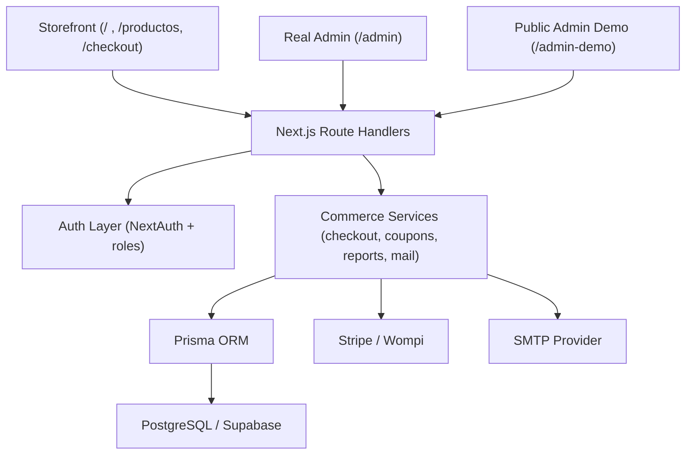

# LilCake Developer Guide

Looking for the product overview? See [README.md](./README.md) or [README.es.md](./README.es.md).
For the Spanish technical version, see [README.dev.es.md](./README.dev.es.md).

LilCake is a Next.js storefront with:

- Next.js App Router
- NextAuth credentials + Google OAuth
- Prisma ORM
- Stripe, Wompi, and WhatsApp-assisted cash-on-delivery/advisor checkout flows
- Admin panel for catalog, media, orders, coupons, customers and reports

[Leer esta guia tecnica en espanol](./README.dev.es.md)

## Documentation structure

- `README.md`: product-facing overview in English
- `README.es.md`: product-facing overview in Spanish
- `README.dev.md`: technical/developer guide in English
- `README.dev.es.md`: technical/developer guide in Spanish

## Admin demo and real admin security

- `/admin-demo` is intentionally public so visitors can explore the admin experience without credentials.
- The demo never writes to the real database and avoids the real admin write APIs by design.
- The real admin stays separate and protected with:
  - role-based access checks on the server
  - protected `/admin` routes
  - protected `/api/admin/*` endpoints
  - session-secret backed authentication
  - rate-limited sensitive actions
  - backend validation and sanitized public errors

## Stack overview

| Layer | Current choice | Purpose |
| --- | --- | --- |
| Framework | Next.js 16 App Router | Storefront, admin, API routes, SSR and RSC |
| UI | Tailwind CSS v4 + Lucide React | Consistent dark UI, dashboards, storefront components |
| Database | PostgreSQL (Supabase) | Production persistence for users, products, orders, coupons and reports |
| ORM | Prisma 6 | Typed queries, schema management, migrations and indexing |
| Auth | NextAuth + credentials + Google OAuth | Role-based access, customer auth, protected admin |
| Payments | Stripe Checkout + Wompi Colombia + WhatsApp fallback | Real payment flow with safe backend finalization, Wompi electronic payments, and advisor-assisted cash-on-delivery/Addi |
| Emails | SMTP mailer | Verification, password recovery, order and shipping notifications |
| Reports | ExcelJS + pdf-lib | Operational exports for sales, orders and customers |
| Deploy | Vercel | Production hosting, env handling and webhook-ready routes |

## Runtime architecture



## Core domain model

| Domain | Main models | Responsibility |
| --- | --- | --- |
| Identity | `User`, `Account`, `Session`, `AccountSecurityToken` | Credentials, Google OAuth, sessions, verification and recovery flows |
| Catalog | `Category`, `Product`, `ProductImage`, `ProductVariant` | Product organization, sortable media gallery, stock and SKU management |
| Cart | `CartItem` | Persisted authenticated cart with safer sync behavior |
| Orders | `Order`, `OrderItem`, `PaymentTransaction` | Checkout snapshots, totals, shipping data, payment state and multi-gateway audit trail |
| Promotions | `Coupon`, `CouponCustomerUsage` | Global and per-customer discount control with safe backend usage tracking |
| Operations | report/export services + transactional emails | Admin exports, order comms, shipping updates and business visibility |

## API surface summary

| Access | Example routes | Notes |
| --- | --- | --- |
| Public | `/api/products`, `/api/categories`, `/api/auth/register`, `/api/checkout/stripe`, `/api/checkout/wompi`, `/api/webhooks/stripe`, `/api/webhooks/wompi` | Storefront reads, auth entry points, checkout bootstrap and payment webhooks |
| Authenticated customer | `/api/cart/sync`, `/api/orders/[id]/resume`, `/api/orders/[id]/cancel`, `/api/checkout/coupon` | Cart sync, order recovery/cancellation and coupon preview/validation |
| Protected admin | `/api/admin/products`, `/api/admin/orders/[id]`, `/api/admin/coupons`, `/api/admin/reports/export` | Catalog, order, coupon and reporting operations guarded by admin checks |

## Development reference moved from local planning docs

- The architecture notes that used to live in `CLAUDE.md` were distilled into this developer guide so the repo keeps the useful technical reference without exposing that local planning file.
- `CLAUDE.md` can stay on the machine as a private workspace note, but it is no longer needed as a tracked source of truth for the project.

## Changelog

### 2026-05-04

- Added PDF sales notes as internal, non-fiscal order documents:
  - `src/lib/sales-note.ts` centralizes PDF generation, `NV-{orderNumber}` numbering, business details from environment variables, and the disclaimer that the document does not replace DIAN e-invoicing
  - `/api/admin/orders/[id]/sales-note` lets the real admin download an order sales note behind the existing admin role guard
  - `/api/orders/[id]/sales-note` lets authenticated customers download only their own order documents
  - `/api/admin-demo/orders/[id]/sales-note` generates sample documents for the public sandbox without touching production data
  - confirmation and shipping emails now attach the generated sales note automatically
  - no database migration was required because the PDF is generated from the existing `Order` and `OrderItem` snapshot

### 2026-05-03

- Added product image ordering to the real admin and public admin demo:
  - `ProductForm` now supports moving product images up or down, keeping the existing cover-image action and delete action
  - image order is preserved in the submitted gallery array and continues to map to the existing `ProductImage.sortOrder` field, so no schema migration was needed
  - `/api/admin/products` and `/api/admin/products/[id]` now return product images ordered by `sortOrder` after list, create and update operations
  - `/admin-demo` product seeds now include multi-image galleries so visitors can test ordering and cover selection safely
  - demo edits preserve the simulated image order without calling real admin write endpoints or touching PostgreSQL
- Polished the storefront after the animation pass:
  - fixed visible Spanish copy with accents, ñ characters, and opening punctuation across home, catalog, cart, checkout, account, registration, login, product detail, and 404 screens
  - the `Experiencia LilCake` section now includes an editorial image, catalog CTA, quick clothing link, and clearer copy
  - fixed category navigation so the top navbar and catalog sidebar stay synchronized with the `?categoria=...` URL state
  - `Navbar` now reads `useSearchParams` inside `Suspense` boundaries so static pages like `/ayuda` and `/_not-found` keep building correctly
  - responsive behavior was verified on mobile, tablet, and desktop without horizontal overflow
- Improved the storefront homepage visual experience without touching backend or checkout logic:
  - added `ScrollReveal` with `IntersectionObserver` for lightweight reusable scroll animations
  - installed `motion` for more expressive React animations in the homepage experience section
  - the hero now includes glow layers, a subtle grid, floating accents, and a shine effect on the main CTA
  - featured products and categories reveal in staggered motion for a more polished and sellable experience
  - redesigned the narrative LilCake experience section with more colorful cards, icons, animated glow, and premium hover motion
  - animations respect `prefers-reduced-motion` for accessibility
- Prepared a safe Wompi Colombia integration without replacing Stripe:
  - added the `PaymentTransaction` model to track provider attempts, references, statuses, payment method type, cent-based amounts, and audit payloads
  - checkout can now create Wompi payments with a unique reference, backend-calculated amount, and server-generated integrity signature
  - added `/api/webhooks/wompi` to receive `transaction.updated`, validate the dynamic checksum, and finalize orders only when Wompi confirms `APPROVED`
  - added `/api/checkout/wompi` to start payments and check return status without trusting frontend data
  - pending order retries now include `WOMPI`, alongside Stripe and WhatsApp
  - admin order detail shows payment transaction traceability and reports use readable payment method labels
  - `NEXT_PUBLIC_WOMPI_ENABLED` remains the feature flag so Wompi can stay hidden until Vercel and sandbox checks pass
- Fixed checkout return handling after Stripe/Wompi payments:
  - the confirmation screen no longer stays "stuck" when returning to `/checkout` for a new purchase
  - the cart is no longer cleared just because the browser visits an old payment-return URL
  - after a payment is confirmed, the visible URL is cleaned so old `session_id` or Wompi `id` parameters are not reused on the next visit
- Improved checkout payment-method presentation:
  - Wompi is now the first option and the default selection when enabled
  - payment methods now show visual badges for Wompi, PSE, Nequi, Visa, Stripe, Mastercard, cash on delivery, Addi, and advisor support
  - the `WHATSAPP` fallback is no longer presented as bank transfer; it now communicates cash-on-delivery or advisor-coordinated payment options

### 2026-04-25

- Improved the responsive experience across the storefront, the real admin, and the public admin demo without changing backend behavior:
  - the storefront now uses tighter mobile spacing, a better-balanced product grid, and more touch-friendly cart, checkout, navbar, and product detail layouts
  - product cards, gallery thumbnails, and purchase CTAs were refined so the mobile flow feels closer to a polished commerce app instead of a compressed desktop layout
  - the real admin and `/admin-demo` now share a mobile-friendly shell with a proper drawer navigation instead of forcing the desktop sidebar into small screens
  - admin products, orders, customers, and coupons now present mobile card views while preserving desktop tables for larger screens
  - the product form, order detail view, export actions, and status controls were reorganized to stack cleanly on phones and small tablets
  - these changes were intentionally limited to frontend layout and UX refinements, so no backend logic, auth rules, payment flow, or database behavior changed

### 2026-04-23

- Fixed production product image uploads on Vercel:
  - local uploads still write to `public/uploads/products` when no Blob token exists
  - production uploads now use Vercel Blob when `BLOB_READ_WRITE_TOKEN` is configured
  - Vercel deployments no longer rely on writing product media into the serverless filesystem
  - the admin product form can keep using the same upload flow while the backend chooses the correct storage provider
  - hardened multipart file detection for the Vercel runtime so uploads are not rejected by fragile `instanceof File` checks
  - restricted the admin file picker to the image formats that the backend validates: JPG, PNG, WEBP, GIF and AVIF
  - switched production uploads to Vercel Blob client uploads with a temporary admin-only token, avoiding Vercel Function request body limits for larger product photos
  - updated the Content Security Policy to allow direct browser uploads to Vercel Blob endpoints

### 2026-04-22

- Separated local development from the database schema used by Vercel:
  - `localhost` now uses a dedicated PostgreSQL/Supabase schema through `.env.local`
  - `npm run dev` and local Prisma scripts now block connections to the remote `public` schema automatically
  - added `npm run db:local:setup` to prepare the local schema, sync Prisma, and seed it without touching production
  - `prisma.config.ts` now loads `.env.local`, so Next.js and Prisma CLI share the same safe local environment
- Fixed the admin product form so it no longer overwrites user input after mount:
  - create/edit pages now preload categories and product data on the server
  - the form stops rehydrating itself once initial data already exists, avoiding fields that look locked or values that revert while typing

- Moved reusable technical planning context out of `CLAUDE.md` and into the developer guides:
  - added a sanitized stack overview, runtime architecture map, domain model summary, and API surface summary
  - kept the useful development reference in `README.dev.md` and `README.dev.es.md`
  - prepared `CLAUDE.md` to stay local-only instead of appearing as a versioned project document

- Added a public `admin-demo` sandbox that is fully separated from the real admin:
  - `/admin-demo` now exposes the admin UI with demo-safe data and simulated actions
  - create, edit, delete, export, and status-update interactions now show demo feedback instead of writing to PostgreSQL
  - the demo uses dedicated mock data and intentionally avoids real admin write endpoints
  - a fixed banner now explains that the environment is only for evaluation and that no changes are persisted
- Clarified route protection so the demo stays public while the real admin remains locked down:
  - route protection now targets `/admin` and `/api/admin/*` precisely, without catching `/admin-demo`
  - the real admin still depends on role-based access, server-side guards, protected admin APIs, session secrets, rate limits, and backend validation
- Split the project documentation more clearly between sales and development audiences:
  - `README.md` and `README.es.md` now act as the product-facing entry points
  - `README.dev.md` and `README.dev.es.md` remain the technical setup, operations, and changelog references
  - the sales READMEs now highlight the live demo, admin demo, sandbox behavior, and evaluation context for external visitors

- Replaced the old "Detailed analytics" placeholder in the admin dashboard with a real business export center:
  - the dashboard now lets admins export `sales`, `orders`, and `customers`
  - reports can be filtered by `today`, `last 7 days`, `last 30 days`, `this month`, or a custom date range
  - the panel now shows live summary metrics, a preview table, and direct export actions
- Added secure admin reporting endpoints:
  - `GET /api/admin/reports/summary` returns the preview and KPI summary for the selected range
  - `GET /api/admin/reports/export` generates the final file in `xlsx` or `pdf`
  - all report calculations are generated from PostgreSQL/Prisma on the server, not from frontend totals
- Added real Excel and PDF exports for business data:
  - Excel exports now include a cleaner executive summary sheet plus the full raw data sheet
  - PDF exports keep the branded LilCake look while staying readable for operational use
  - the export layer now supports sales, orders, and customer activity reporting from the same shared backend service
- Fixed the first export-center regressions after implementation:
  - the export request now always sends a valid format so `xlsx` and `pdf` downloads no longer fail with a format error
  - the admin export panel effect was stabilized to avoid the React/Turbopack dependency error that appeared while filtering
  - the Excel summary sheet was restyled for better readability and contrast
  - the PDF data table spacing was adjusted so the first row no longer appears visually cut off under the header
- Improved password inputs across the app:
  - shared password fields now include a show/hide toggle with an eye icon
  - this applies to customer login, registration, password reset, and admin login
  - the control is keyboard-accessible and avoids covering the typed text
- Finished the first full Vercel production rollout:
  - the project is now linked to Vercel and deployed on `https://lilcake.vercel.app`
  - production environment variables were configured for PostgreSQL, auth, email, Google OAuth, WhatsApp, and Stripe test mode
  - a Stripe webhook endpoint was created for `https://lilcake.vercel.app/api/webhooks/stripe`
  - production routing and public pages were rechecked after deployment, including live product data coming from PostgreSQL/Supabase
  - a `.vercelignore` file was added so future deployments do not upload local env files or unnecessary local artifacts

### 2026-04-21

- Added mandatory legal consent for account creation and checkout:
  - email/password registration now requires accepting terms and privacy policy
  - Google account creation is blocked server-side unless consent was captured first
  - checkout now requires legal acceptance before any Stripe, Wompi, or WhatsApp order can be created
  - backend validation now rejects attempts to bypass that checkbox from the frontend
- Improved Stripe checkout confirmation reliability:
  - the return endpoint now safely finalizes the paid order if Stripe already marked the session as paid but the webhook has not reached the local environment yet
  - order finalization now uses a database row lock to avoid duplicate stock changes if the webhook and the return flow race each other
- Expanded order shipping data and customer visibility:
  - orders now persist `customerEmail`, `shippingCarrier`, `trackingNumber`, `confirmedAt`, `shippedAt`, and email delivery timestamps
  - the admin order detail now includes a dedicated shipping/tracking block and a record of sent customer emails
  - the customer order detail now includes a clearer shipping section with carrier, guide number, and confirmation/shipping timestamps
  - the customer account list now surfaces shipping guide data directly when available
- Added operational shipping rules in admin:
  - the admin order form now collects `shippingCarrier` and `trackingNumber`
  - an order cannot be marked as shipped until both carrier and guide number exist
  - admin order search now also matches carrier and tracking guide values
- Added transactional order notification emails:
- WhatsApp/cash-on-delivery manual orders now send a “pedido recibido” email when the order is created
  - paid or confirmed orders now send a “pedido confirmado” email
  - shipped orders now send a “pedido enviado” email with carrier and guide details
  - notification timestamps are stored on the order so there is an auditable record of what was sent
  - the same branded email system is reused for account-security and order emails

### 2026-04-20

- Added a real coupon system connected to checkout and admin:
  - coupons can now be created, edited, activated, deactivated, and deleted from the admin panel
  - the checkout only sends the coupon code; all validation and discount calculation happen server-side
  - orders now persist subtotal, discount, total, and the coupon reference
  - coupon usage is reserved transactionally when a pending order is created and released if that order fails or is cancelled before payment
  - Stripe checkout now receives the approved discount from the backend, so the charged amount matches the order total
- Added dual coupon limits:
  - global usage limit across all customers
  - per-customer usage limit for the same coupon
  - a dedicated `CouponCustomerUsage` table now tracks per-user usage safely
  - the admin panel now surfaces remaining global uses and the per-customer rule separately
- Improved the admin coupon UX:
  - coupon creation/editing now opens in a dedicated modal instead of a compressed side panel
  - the form explains global vs per-customer limits more clearly
  - exhausted coupons are now marked as `Agotado`
- Improved checkout convenience:
  - shipping fields now use browser autocomplete metadata
  - customers can choose to remember shipping details in the local browser for future purchases
  - checkout pre-fills saved details and authenticated profile data when available
- Added stronger account security flows:
  - password policy now requires uppercase, lowercase, number, symbol, and confirmation
  - users can create or change passwords from the account area
  - password changes now go through verified email links and one-time tokens
- Added email verification and password reset flows:
  - verification emails
  - forgot-password flow
  - password reset page with expiring token validation
- Added branded SMTP email support and Gmail local setup guidance
- Documented the security and email setup in detail in the README files
- Added a real storefront search experience:
  - the navbar search icon now opens a lateral search panel
  - product search becomes live after 3 characters
  - the catalog page now refines results dynamically while typing
  - shared search scoring was extracted into `src/lib/product-search.ts`
- Added live admin table search for products, orders, and customers:
  - new reusable admin search input and scoring helpers
  - filtering now works instantly inside the current table data
  - empty states and result counters now react to the current query
- Improved account email UX and reliability:
  - the branded security email header now uses a stable HTML/CSS monogram instead of the original image logo, which rendered badly in some desktop email clients
  - account security messaging was cleaned up and normalized
- Fixed Google sign-in account linking:
  - new users can sign in with Google and get created correctly
  - existing users with the same email can link Google without the Prisma update error seen during sign-in
- Hardened admin, auth, and checkout/server flows:
  - admin pages and admin APIs now share centralized server-side ADMIN guards instead of repeating role checks inline
  - admin image uploads now validate real file signatures for supported formats instead of trusting only the browser MIME type
  - registration, forgot-password, reset-password, resend-verification, password-change requests, email verification, and checkout coupon previews now use rate limits to reduce brute-force and spam traffic
  - public API responses now sanitize Prisma/internal errors before sending them back to the browser, while server logs still keep the debugging detail
- Improved Stripe reliability and post-payment behavior:
  - the checkout success screen now polls the backend for a short period while the Stripe webhook finishes finalizing the order
  - the Stripe status endpoint is now tied to the signed-in order owner and can recover the order by saved `stripeSessionId` even if metadata is missing
  - webhook signature failures now return a generic invalid-signature response instead of echoing raw parser errors
- Tightened platform configuration and schema safety:
  - `next.config.ts` now sends a Content Security Policy that explicitly allows Stripe, Google Fonts, and local development websocket traffic
  - Prisma now uses real enums for `User.role`, `Order.status`, and `Order.paymentStatus` instead of free-form strings
  - the latest schema migration also adds an index on `Order.stripeSessionId` for faster webhook and checkout-status lookups
- Added real legal pages for the storefront:
  - `/privacidad` now renders the full data-processing and privacy policy with the current LilCake visual style
  - `/terminos` now renders the terms and conditions with structured sections and quick navigation
  - footer legal links now resolve to live pages instead of dead routes
  - both pages can surface a configured support email from `NEXT_PUBLIC_SUPPORT_EMAIL`, `SMTP_FROM`, or `SMTP_USER`
- Expanded project documentation with dated release notes for easier version tracking

### 2026-04-19

- Implemented the real Stripe order finalization flow:
  - checkout creates pending orders before redirect
  - Stripe Checkout Session now carries secure metadata
  - `/api/webhooks/stripe` verifies the signature and finalizes payment server-side
  - paid orders decrement stock transactionally and clear the authenticated cart
- Updated the order flow docs to explain webhook setup and local Stripe CLI usage

### 2026-04-18

- Migrated the project database from SQLite to PostgreSQL with Supabase-oriented configuration
- Added Prisma migration history, `prisma.config.ts`, and database scripts for generate, migrate, deploy, seed, and studio
- Added automatic Prisma client generation on dependency install through `postinstall`
- Improved cart sync:
  - cart persistence is versioned per user
  - guest/authenticated cart transitions are safer
  - stale local overwrites are reduced
- Made Stripe optional per environment:
- checkout falls back to WhatsApp for cash-on-delivery or sales-advisor coordination
  - Stripe SDK initialization is lazy
  - payment endpoints can stay disabled until keys exist
- Extracted storefront data queries into cached helpers with `unstable_cache`
- Reduced payload sizes and improved data access with narrower Prisma `select` queries and extra indexes
- Moved security headers into `next.config.ts` and kept `src/proxy.ts` focused on admin protection

### 2026-04-17

- Added Google sign-in support for login and registration
- Added deployment-oriented auth documentation and environment variable guidance
- Imported the initial project into Git and GitHub

## Local setup

1. Install dependencies:

```bash
npm install
```

`npm install` now runs `prisma generate` automatically. If the Prisma client ever goes stale after reinstalling dependencies, stop the dev server and run `npm run db:generate` once.

2. Copy the environment template:

```bash
cp .env.example .env
```

3. Generate a secure auth secret:

```bash
node -e "console.log(require('crypto').randomBytes(32).toString('base64'))"
```

4. Create/apply the Prisma migration:

```bash
npm run db:migrate
```

5. Seed the database:

```bash
npm run db:seed
```

6. Start the app:

```bash
npm run dev
```

## Environment variables

- `DATABASE_URL`: PostgreSQL connection string used by the app runtime.
- `DIRECT_URL`: direct PostgreSQL connection string used by Prisma CLI commands.
- `NEXTAUTH_URL`: the public URL of the app.
- `NEXTAUTH_SECRET`: secret used by NextAuth sessions. Use a long random value with at least 32 characters.
- `GOOGLE_CLIENT_ID`: Google OAuth client id.
- `GOOGLE_CLIENT_SECRET`: Google OAuth client secret.
- `SMTP_HOST`: SMTP host used to send verification and password reset emails.
- `SMTP_PORT`: SMTP port.
- `SMTP_SECURE`: `true` for implicit TLS transports such as port 465, otherwise `false`.
- `SMTP_USER`: SMTP username if your provider requires authentication.
- `SMTP_PASS`: SMTP password if your provider requires authentication.
- `SMTP_FROM`: sender shown in verification and password reset emails.
- `STRIPE_SECRET_KEY`: Stripe server key.
- `STRIPE_PUBLISHABLE_KEY`: Stripe public key.
- `STRIPE_WEBHOOK_SECRET`: Stripe webhook secret. Required once your Stripe webhook endpoint is registered.
- `NEXT_PUBLIC_STRIPE_ENABLED`: set to `true` only in environments where you want the Stripe checkout option to be visible.
- `NEXT_PUBLIC_WOMPI_ENABLED`: set to `true` only after the Wompi checkout has been validated in that environment.
- `WOMPI_ENVIRONMENT`: `sandbox` or `production`.
- `NEXT_PUBLIC_WOMPI_PUBLIC_KEY`: Wompi merchant public key.
- `WOMPI_PRIVATE_KEY`: Wompi private key, reserved for direct API integrations.
- `WOMPI_EVENTS_SECRET`: event secret used to verify `X-Event-Checksum` or `signature.checksum`.
- `WOMPI_INTEGRITY_SECRET`: integrity secret used to sign `reference + amount + currency`.
- `NEXT_PUBLIC_WHATSAPP_NUMBER`: WhatsApp destination number.
- `NEXT_PUBLIC_APP_URL`: public app URL used by client flows.
- `NEXT_PUBLIC_APP_NAME`: display name.
- `NEXT_PUBLIC_SUPPORT_EMAIL`: public support/legal contact email shown in storefront legal pages.

## Safe local database separation

Local development must not use the same PostgreSQL schema that powers Vercel production.
This repo now supports a safer setup where localhost uses a dedicated schema inside the
same Supabase/PostgreSQL instance.

How it works:

- `.env` keeps the shared/base PostgreSQL credentials.
- `.env.local` overrides `DATABASE_URL` and `DIRECT_URL` with `?schema=local_<user>`.
- `npm run dev` now refuses to start if local is still pointing at the remote `public` schema.
- local Prisma scripts (`db:migrate`, `db:push`, `db:seed`, `db:studio`) also refuse to run
  against the remote `public` schema unless you explicitly set `ALLOW_PRODUCTION_DATABASE=true`.
- `prisma.config.ts` now loads `.env.local`, so Prisma CLI follows the same local overrides as Next.js.

Recommended first-time setup:

```bash
npm run db:local:setup
```

That command:

1. generates or updates `.env.local`
2. creates local-only database URLs using a dedicated schema
3. runs `prisma db push`
4. runs the seed on the local schema

After that, restart local development with:

```bash
npm run dev
```

Important notes:

- This keeps localhost separate from Vercel even if both environments use the same Supabase project.
- The separation happens at the PostgreSQL schema level, not by sharing production tables.
- If you ever need a completely different database later, you can still replace the local URLs in `.env.local`.
- Avoid running raw `prisma ...` commands directly; prefer the npm scripts so the safety checks always run.

## Google sign-in setup

The project already supports Google in `next-auth`, but it only turns on when both `GOOGLE_CLIENT_ID` and `GOOGLE_CLIENT_SECRET` exist.

1. Open Google Cloud Console.
2. Create or reuse a project.
3. Configure the OAuth consent screen.
4. Create an OAuth Client ID of type `Web application`.
5. Add these Authorized JavaScript origins:
   - `http://localhost:3000`
   - your production domain, for example `https://lilcake.vercel.app` or your custom domain
6. Add these Authorized redirect URIs:
   - `http://localhost:3000/api/auth/callback/google`
   - `https://your-production-domain/api/auth/callback/google`
7. Copy the generated client id and client secret into `.env` and Vercel environment variables.
8. Restart the local server after updating env vars.

Notes:

- The register screen includes a Google button too. On first login, NextAuth creates the customer account automatically.
- Google sign-in now marks the account email as verified automatically.
- Google requires exact redirect URIs. Because of that, changing preview URLs are inconvenient for OAuth. Production should use a stable domain.

## Account security and email flows

- Credential sign-up now enforces a minimum of 6 characters plus uppercase, lowercase, number, and symbol requirements.
- Sign-up and password reset both require password confirmation.
- Signed-in users can create or change their password from `/cuenta`.
- Registration now sends an email verification link, and authenticated users can resend that link from the account page if needed.
- Password reset is available from `/recuperar-contrasena`, with a one-time token that expires after one hour.
- If SMTP variables are missing, the app keeps working in local development and prints the verification/reset link in the server console instead of sending a real email.
- Before production, configure a real SMTP provider in Vercel so verification and recovery emails are actually delivered.

### Current account security flow

1. A customer signs up with email/password or with Google.
2. Email/password sign-up validates the password policy and requires password confirmation.
3. After registration, the backend sends a verification email.
4. Google sign-in marks the email as verified automatically.
5. From `/cuenta`, the user can request a password change only through their verified email.
6. The account page does not expose the password form permanently anymore. Instead, it shows a `Change password` or `Create password` button.
7. Clicking that button sends a temporary one-time email link to the verified address.
8. That link opens `/restablecer-contrasena` with a secure token and lets the user define the new password there.

### Security details

- Email verification tokens and password reset/change tokens are stored hashed in the database.
- Tokens are single-use and become invalid after use.
- Password reset/change links expire after one hour.
- Email verification links expire after 24 hours.
- Password changes from the account page are blocked until the email is verified.
- The reset/change form still validates password confirmation plus the full password policy.
- The account change flow reuses the same temporary token system as forgot-password, but it can only be initiated by an authenticated user.
- Auth-facing endpoints now have lightweight in-process rate limits to slow down repeated register, reset, verification, and password-change abuse attempts.

## Admin and API hardening

- Admin pages now enforce `ADMIN` access server-side from the admin layout, and admin API routes reuse centralized guards before touching business logic.
- Admin upload endpoints now validate file signatures for supported image formats instead of relying only on file extensions or browser-provided MIME types.
- Checkout, auth, order, and webhook routes now sanitize unexpected internal errors through a shared public-error helper so production responses leak less implementation detail.
- The checkout coupon preview endpoint is rate-limited per user and IP to make coupon probing harder.
- `next.config.ts` now sends a Content Security Policy that allows Stripe checkout resources while still blocking unapproved frames, objects, and third-party scripts by default.

### Local Gmail SMTP example

For local development you can use Gmail SMTP with an app password:

```env
SMTP_HOST="smtp.gmail.com"
SMTP_PORT="465"
SMTP_SECURE="true"
SMTP_USER="your-gmail@gmail.com"
SMTP_PASS="your-google-app-password"
SMTP_FROM="LilCake <your-gmail@gmail.com>"
```

Notes:

- Use a Google app password, not your normal Gmail password.
- In local development, links usually point to `http://localhost:3000`, so they only work from the same machine running the app.
- The branded email header now uses a lightweight HTML/CSS LilCake monogram instead of the original image logo for better desktop email compatibility.
- The same SMTP settings should be added to Vercel later if you want real delivery outside local development.

### Relevant routes

- `POST /api/auth/register`: create account and trigger verification email
- `POST /api/auth/resend-verification`: resend verification for the signed-in user
- `POST /api/auth/forgot-password`: start recovery flow from login
- `POST /api/auth/request-password-change`: start password change flow from `/cuenta`
- `POST /api/auth/reset-password`: submit the new password with the temporary token
- `GET /api/auth/verify-email`: consume the verification token and mark the email as verified

## Product image uploads in Vercel

Product image uploads use two storage modes:

- Local development without `BLOB_READ_WRITE_TOKEN`: files are written to `public/uploads/products`.
- Vercel production with `BLOB_READ_WRITE_TOKEN`: files are uploaded to Vercel Blob and the product stores the public Blob URL.

Why this matters:

- Vercel Functions do not provide persistent project-disk storage for uploaded media.
- Writing to `public/uploads/products` is fine locally, but it is not reliable for production uploads.
- Vercel Blob gives the admin product form persistent public URLs without changing the product CRUD flow.

Production setup:

1. In Vercel, connect a Blob store to the `lilcake` project.
2. Confirm that `BLOB_READ_WRITE_TOKEN` exists in the Production environment variables.
3. Redeploy the project.
4. Test an admin product upload from `/admin/productos/[id]/editar`.

If the token is missing in Vercel, the upload endpoint returns a clear configuration error instead of silently pretending the file was saved.

Gallery ordering behavior:

- The admin form treats the image array order as the desired storefront order.
- The first image is the cover image shown first in product cards and product pages.
- Admins can move images up or down before saving, or use "Make primary" to move one image directly to the front.
- On save, the API rewrites image records for that product with sequential `sortOrder` values.
- Reads from admin APIs return images ordered by `sortOrder` so the edit form, tables and storefront stay consistent.
- The public `/admin-demo` uses the same UI controls but stores the simulated order only in demo state/session storage.

## Deploying to Vercel

1. Push the repository to GitHub.
2. Import the project into Vercel.
3. Add the same environment variables in Vercel for Production and, if needed, Preview/Development.
4. Set `NEXTAUTH_URL` and `NEXT_PUBLIC_APP_URL` to the production domain.
5. Trigger a new deployment.

Important connection notes:

- On many local IPv4 networks, the Supabase direct host (`db.<project-ref>.supabase.co`) will not resolve.
- For this repo, use the Supavisor Transaction Pooler (`:6543` with `?pgbouncer=true`) in `DATABASE_URL` and the Session Pooler (`:5432`) in `DIRECT_URL`.
- If your environment supports IPv6 or you buy the Supabase IPv4 add-on later, `DIRECT_URL` can point to the direct host instead.
- For Vercel/serverless later, keep `DATABASE_URL` on the Transaction Pooler. You can optionally append `connection_limit=1` if you hit connection pressure in serverless.
- If Stripe is not part of the current environment yet, keep `NEXT_PUBLIC_STRIPE_ENABLED=false` and leave Stripe payments disabled until the payment rollout resumes.
- Admin product image uploads should use Vercel Blob in production through `BLOB_READ_WRITE_TOKEN`; local development can still fall back to `public/uploads/products`.

### Current production setup

- Active production domain: `https://lilcake.vercel.app`
- Google OAuth production redirect URI:
  - `https://lilcake.vercel.app/api/auth/callback/google`
- Stripe webhook production endpoint:
  - `https://lilcake.vercel.app/api/webhooks/stripe`
- Wompi webhook production endpoint:
  - `https://lilcake.vercel.app/api/webhooks/wompi`

Operational notes:

- Google OAuth is enabled in production after loading `GOOGLE_CLIENT_ID` and `GOOGLE_CLIENT_SECRET` into Vercel.
- Stripe is currently enabled in production in test mode using test publishable and secret keys.
- Wompi should be loaded in Vercel with sandbox keys and kept behind `NEXT_PUBLIC_WOMPI_ENABLED=false` until controlled checks pass.
- The production deployment was verified with live product routes on Vercel and a direct Prisma/PostgreSQL connection against Supabase.
- Admin image uploads use Vercel Blob in production when `BLOB_READ_WRITE_TOKEN` is configured, and keep a local filesystem fallback for development.

## Orders and Stripe webhook flow

The checkout flow now works like this:

1. The customer submits checkout from the storefront.
2. The backend reloads product and variant data from Prisma, validates stock and price, and creates a pending `Order` plus `OrderItem` records before redirecting to Stripe.
3. The Stripe Checkout Session includes secure metadata such as `orderId`, `orderNumber`, and `userId`.
4. Stripe calls `POST /api/webhooks/stripe`.
5. The webhook verifies the `stripe-signature` header with `STRIPE_WEBHOOK_SECRET`.
6. On `checkout.session.completed` or `checkout.session.async_payment_succeeded`, the order is finalized exactly once: payment moves to `PAID`, the order moves to confirmed, stock is decremented transactionally, and the user cart is cleared server-side.
7. On `checkout.session.async_payment_failed` or `checkout.session.expired`, the order is marked as failed without trusting the frontend.
8. After the customer returns to `/checkout?success=true`, the storefront polls the backend until finalization resolves to `paid` or `failed`.
9. If Stripe already marks the Checkout Session as paid but the webhook has not arrived yet, the signed-in return endpoint can now finalize the order safely as a fallback. This keeps local development and intermittent webhook delivery from freezing the confirmation screen.

The webhook endpoint is:

```text
/api/webhooks/stripe
```

For local testing with the Stripe CLI:

```bash
stripe listen --forward-to localhost:3000/api/webhooks/stripe
```

Use the webhook signing secret printed by the CLI as `STRIPE_WEBHOOK_SECRET` in local development.

The checkout status endpoint used by the return page is:

```text
/api/checkout/stripe?session_id=cs_test_...
```

It now requires the signed-in order owner and may return `pending`, `processing`, `paid`, or `failed` while the webhook catches up.

## Wompi Colombia flow

Wompi is integrated as a parallel provider and is visible only when `NEXT_PUBLIC_WOMPI_ENABLED=true`:

1. The customer chooses Wompi at checkout.
2. The backend validates cart items, prices, stock, coupons, and legal acceptance before creating the `Order`.
3. A `PaymentTransaction` is created with provider `WOMPI`, a unique reference, and a cent-based amount.
4. The Wompi checkout URL is signed server-side with `WOMPI_INTEGRITY_SECRET`; secrets never reach the frontend.
5. Wompi redirects back to `/checkout?provider=wompi&id=...`, where the backend checks the real transaction state.
6. Wompi calls `POST /api/webhooks/wompi`; the endpoint verifies the dynamic checksum with `WOMPI_EVENTS_SECRET`.
7. Only `APPROVED` finalizes the order through `finalizePaidOrder`; `DECLINED`, `VOIDED`, or `ERROR` mark the payment as failed and allow retry.

Configured Wompi events endpoint:

```text
https://lilcake.vercel.app/api/webhooks/wompi
```

Security notes:

- The charged total is calculated from the backend order, not from the browser.
- Currency must be `COP`, and the amount must match `amount_in_cents` exactly.
- Event signature validation uses the properties sent by Wompi in each payload; the code does not assume a fixed list.
- For a safe rollout, load secrets in Vercel first, keep `NEXT_PUBLIC_WOMPI_ENABLED=false`, validate the webhook, then enable the button.

## Shipping tracking and order emails

Order logistics are now part of the real admin and customer experience.

- Each order can store:
  - `shippingCarrier`
  - `trackingNumber`
  - `confirmedAt`
  - `shippedAt`
  - `receiptEmailSentAt`
  - `confirmationEmailSentAt`
  - `shippingEmailSentAt`
- The admin order detail page now includes:
  - shipping carrier and tracking guide fields
  - timestamps for confirmation and shipment
  - a visible record of order-related emails already sent to the customer
- The customer order detail now shows:
  - delivery recipient data
  - shipping carrier and guide
  - confirmation and shipment timestamps when available
- Admin order search now supports tracking-guide and carrier lookups.

### Order email behavior

- `WHATSAPP` orders represent the cash-on-delivery/advisor flow and send a receipt email when the order is created.
- Orders confirmed by payment or by admin state transitions send a confirmation email.
- Orders marked as `SHIPPED` send a shipment email with carrier and tracking details.
- Shipment emails only go out once both `shippingCarrier` and `trackingNumber` are present.
- Email send timestamps are stored on the order so support/admin can audit what happened later.

## Legal consent at registration and checkout

- Registration now requires accepting the terms and conditions plus the privacy policy.
- Google sign-up is also protected server-side, not just by the browser UI.
- Checkout blocks order creation until the customer explicitly accepts the legal documents.
- Those checks are validated again in the backend, so editing frontend requests is not enough to bypass them.

## Coupons and discount security

Coupons are now part of the real order flow rather than a frontend-only preview.

### How coupon validation works

1. The storefront sends only `couponCode`.
2. The backend reloads trusted prices from Prisma and recalculates the order subtotal.
3. Coupon validation checks:
   - active/inactive status
   - expiration date
   - minimum purchase amount
   - global usage limit (`maxUses`)
   - per-customer usage limit (`maxUsesPerUser`)
4. If valid, the backend stores the approved `discount`, `total`, and `couponId` on the pending order.
5. Stripe checkout receives a server-generated discount coupon so the Stripe total matches the approved backend total.
6. If the payment flow fails or the order is cancelled before being paid, the reserved coupon usage is released again.

### Global limit vs per-customer limit

- Global limit: the total number of times a coupon can be used across the entire store.
- Per-customer limit: the number of times the same authenticated user can use that coupon.

Example:

- `maxUses = 100`
- `maxUsesPerUser = 1`

This means up to 100 paid/pending reservations in total are allowed, but each signed-in customer can only consume that coupon once.

### Relevant coupon files

- `src/lib/coupons.ts`: secure coupon validation, usage reservation, release, and Stripe discount helper
- `src/lib/admin-coupons.ts`: admin payload validation and serialization
- `src/app/api/checkout/coupon/route.ts`: checkout-side coupon preview endpoint
- `src/app/api/admin/coupons/route.ts`
- `src/app/api/admin/coupons/[id]/route.ts`
- `src/components/admin/AdminCouponsManager.tsx`

## Checkout autofill and remembered shipping details

The checkout now supports both browser-native autocomplete and local remembering of shipping details.

- Inputs expose autocomplete hints such as:
  - `shipping name`
  - `email`
  - `shipping street-address`
  - `shipping address-level2`
  - `tel`
- Customers can opt in to saving their shipping details in the current browser.
- Saved values are stored locally and reused on future visits to `/checkout`.
- If the customer is authenticated, checkout also pre-fills available account name/email values.
- This is local-browser convenience only; the discount logic and order totals still remain fully server-controlled.

## Business reports and exports

The admin dashboard now includes a report export center instead of a static analytics placeholder.

- Available report types:
  - `sales`
  - `orders`
  - `customers`
- Available time filters:
  - `today`
  - `last7`
  - `last30`
  - `thisMonth`
  - `custom`
- Available export formats:
  - `xlsx`
  - `pdf`

### What the export center does

- Shows a live summary before exporting
- Displays KPI metrics for the selected report type
- Includes a preview table with representative rows
- Lets the admin export the exact filtered dataset to Excel or PDF

### Data source and security

- Reports are generated from server-side Prisma queries against PostgreSQL
- The browser does not calculate revenue or row totals for the final export
- Admin guards protect both summary and export endpoints

### Report endpoints

- `GET /api/admin/reports/summary`
- `GET /api/admin/reports/export`

### Report implementation files

- `src/components/admin/BusinessExportPanel.tsx`
- `src/lib/business-reports.ts`
- `src/app/api/admin/reports/summary/route.ts`
- `src/app/api/admin/reports/export/route.ts`

## PostgreSQL migration plan

This repo now uses Prisma over PostgreSQL with Supabase and keeps the same data model the app already consumes.

Recommended workflow:

1. Keep `DATABASE_URL` on the Supabase Transaction Pooler.
2. Keep `DIRECT_URL` on the Supabase Session Pooler for Prisma CLI workflows.
3. Run `npm run db:migrate` locally after pulling schema changes such as the `User.cartVersion` migration and the order/user enum migration.
4. Use `npm run db:migrate` while developing new schema changes.
5. Use `npm run db:seed` to repopulate local/dev data from scratch.
6. When deploying to Vercel later, keep `DATABASE_URL` on the transaction pooler and run `npm run db:deploy`.

## Useful commands

```bash
npm run dev
npm run lint
npm run build
npm run db:generate
npm run db:migrate
npm run db:deploy
npm run db:push
npm run db:seed
npm run db:studio
```
