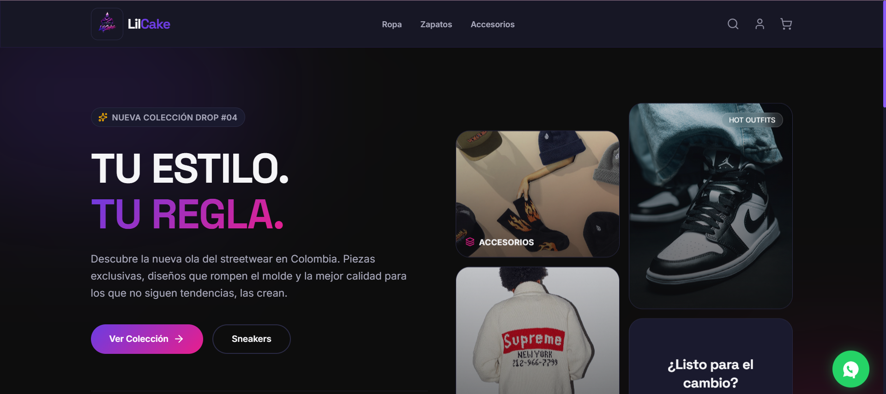
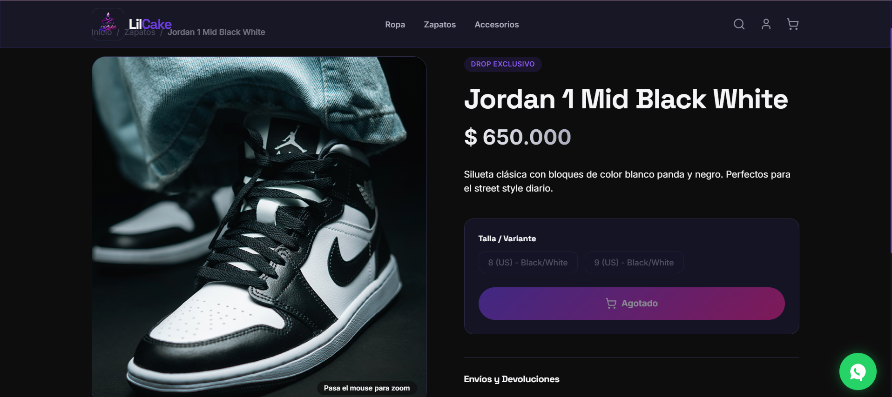
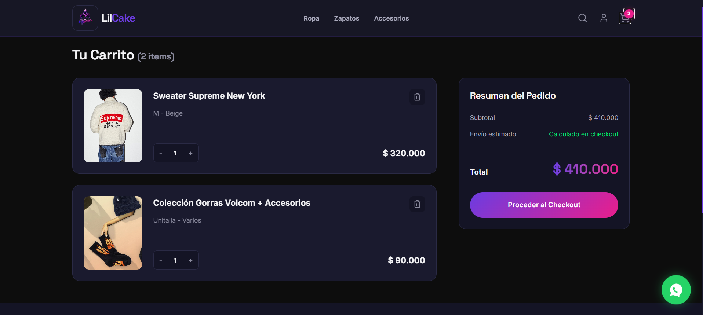

# LilCake Commerce System

Launch a customizable e-commerce system with storefront, admin, payments, coupons, and operations in one production-ready base. 🚀

LilCake is not just a store theme. It is a complete, customizable commerce system designed to be adapted to different businesses, catalogs, and operational flows without rebuilding the core from scratch.

[Live Demo](https://lilcake.vercel.app/) · [Admin Demo](https://lilcake.vercel.app/admin-demo) · [Versión en Español](./README.es.md) · [Technical Docs](./README.dev.md) · [Guía Técnica en Español](./README.dev.es.md)

## What is this?

LilCake Commerce System is a full e-commerce platform built to help brands launch, manage, and scale online sales with a real operational backbone behind the storefront.

It combines customer-facing shopping flows with an internal admin system, order management, discount controls, transactional emails, reporting, and production-oriented backend validation. The visual identity can be customized for different businesses, while the system logic stays solid and reusable.

The current demo uses a fashion/streetwear brand, but the product is meant to be re-skinned and adapted to many different business models.

## See the Admin in Action

If you want to evaluate the operational side of the product first, go straight to the admin sandbox:

👉 [Open the Admin Demo](https://lilcake.vercel.app/admin-demo)

Inside the demo you can explore:

- product and catalog management
- multi-image product galleries with cover selection and ordering controls
- order monitoring and customer visibility
- coupon controls, exports, and operational workflows

### Admin Preview

## Features

- Per-order PDF sales notes for internal proof, admin/customer downloads, and email attachments
- Admin-managed business settings for the commercial details used in sales notes

- Retail-oriented storefront design with an editorial hero, cleaner product cards, calmer catalog filters, and restrained LilCake accent usage
- Commercial trust layer with local payment signals, shipping/support cues, sale merchandising, and cart confirmation UX
- 🛍️ Storefront ready to sell with catalog, product pages, cart, search, and checkout flow
- 🖼️ Persistent product media storage with multi-image galleries, cover selection, custom ordering, and Vercel Blob support
- 🔐 Flexible authentication with email/password and Google sign-in
- 💳 Real checkout experience with Wompi, Stripe, PSE, Nequi, and WhatsApp-assisted cash-on-delivery or Addi options
- 📦 Complete order lifecycle with payment states, shipment tracking, and customer visibility
- 🎟️ Advanced coupon engine with global limits, per-customer limits, and admin control
- 🧾 Excel and PDF exports for sales, orders, and customer data
- Admin product sale toggle using validated compare-at pricing for visible offers
- 📬 Transactional emails for verification, password recovery, purchase updates, and shipping notifications
- 🔎 Dynamic search in both the storefront and the admin panel
- 🧠 Backend-first security logic so prices, discounts, and checkout totals are not trusted from the browser
- ⚙️ Admin panel to manage products, customers, coupons, orders, and business operations

## Live Demo

Explore the live system here:

👉 [https://lilcake.vercel.app/](https://lilcake.vercel.app/)

If you are evaluating the product for a brand, a client project, or a custom commerce build, start with the live storefront and then explore the admin sandbox to see how the system behaves end to end.

Best way to evaluate the system:

1. Explore the storefront experience in the live demo.
2. Open the admin demo to review operations, orders, coupons, and exports.
3. Use the screenshots below to get a quick overview before diving deeper.

## ⚠️ Demo Information

- This public deployment is a demonstration environment.
- Products, customers, orders, and business activity shown in the demo are sample data.
- The goal is to show the system capabilities, navigation, and operational flow.
- Some actions may be simulated or reset as part of the demo experience.
- The demo should be used to evaluate features, not as a real commercial environment.

## 🔒 Admin Demo

A safe admin sandbox is available at:

👉 [https://lilcake.vercel.app/admin-demo](https://lilcake.vercel.app/admin-demo)

- It exposes the admin experience without requiring access to the real admin panel.
- It is isolated from production operations and does not write to the real business data.
- Create, edit, delete, and export actions are simulated to demonstrate the workflow.
- Product media actions are also demo-safe, so visitors can test image ordering and cover selection without touching real catalog data.
- A visible demo banner makes it clear that nothing is permanently stored.
- The real admin remains protected with role-based access, secured sessions, protected write APIs, rate limits, and backend validation.

## Recent Improvements

- As of 2026-05-11, the storefront gained a stronger commercial confidence layer inspired by real fashion retail references: top service bar, payment/shipping/support highlights, richer footer trust signals, sale sections, stock cues, and clearer add-to-cart confirmation.
- The top service banner was removed after visual review. The payment/shipping/support block is now an image-led trust carousel, and sale products now render in a quieter horizontal rail instead of a fixed grid.
- The trust carousel now uses one consistent store visual and clearer Spanish copy so slide changes do not resize, jump, or cover headline text.
- The admin product form now includes a dedicated sale toggle. It uses the existing `compareAtPrice` field, validates that the previous price is greater than the final price on both client and server paths, and surfaces offer badges in admin and storefront product cards.
- As of 2026-05-10, the storefront received a retail design pass focused on making LilCake look more professional and less template-generated without touching backend behavior.
- Product detail now separates direct purchase from cart building: shoppers can pay for only the selected variant with Buy now, or keep adding items through Add to cart.
- Checkout payment methods now use real local logo assets for Wompi/PSE banks, card networks, and assisted WhatsApp payment options.
- Checkout legal acceptance now sits directly above the payment button so shoppers understand why the CTA is enabled or disabled.
- The home hero now uses a stronger sneaker-store interior visual, and the confidence section carries the featured-product and lookbook carousel so the first viewport stays cleaner.
- Brand color accents were restored on the LilCake wordmark, WhatsApp CTA, and footer social icons while keeping the restrained retail direction.
- The home, catalog, product detail, cart, help, auth surfaces, shared cards, and storefront chrome now use a more restrained visual language: fewer glows and gradients, tighter radii, clearer product hierarchy, and more commercial trust cues.
- As of 2026-05-05, Wompi Colombia is enabled in production, giving shoppers a local payment experience for PSE, Nequi, cards, and other methods available through Wompi.
- The payment setup is handled behind the scenes with server-side verification, so customers get a smoother Colombian checkout while business credentials stay protected.
- As of 2026-05-04, real orders can generate internal PDF sales notes downloadable from the admin, customer account, and admin demo.
- As of 2026-05-04, the real admin now includes a business settings section for editing business name, identification, email, phone, address, city, logo URL, and the sales-note legal text without touching environment variables.
- The admin demo exposes the same experience in sandbox mode, simulating saves without writing production data.
- Confirmation and shipping emails can now attach the order sales note while clearly stating that it does not replace official Colombian e-invoicing documents.

- As of 2026-05-03, the real admin and admin demo now support reorderable product image galleries, so operators can control the visual order shown to customers instead of only choosing a cover image.
- Demo products now include richer multi-image galleries, making the public admin sandbox more useful for evaluating real catalog management workflows.
- As of 2026-05-03, the storefront received an additional visual polish pass on the home experience, with more expressive animations, an editorial image section, and direct catalog CTAs.
- Category navigation was also fixed so the top navbar and catalog sidebar stay synchronized, alongside a visible Spanish-copy cleanup for a more polished presentation.
- As of 2026-04-25, the storefront, real admin, and admin demo received a full responsive UX pass focused on phones and tablets.
- Product browsing, cart, checkout, admin navigation, and admin data views now feel cleaner on small screens while keeping the desktop experience intact.

## Screenshots

### Home Experience

### Product Detail

### Checkout Flow

### Orders Management

### Coupons Engine

### Admin Dashboard

## Use Cases

- Fashion brands that want a polished online store with a serious operational backend
- Boutique retailers that need catalog control, secure checkout, and order traceability
- Businesses that run promotions and need coupon rules that do not break margins
- Teams that need admin visibility over customers, orders, shipping, and exports
- Merchandising teams that need control over product galleries, cover images, and visual order
- Agencies or developers who want a customizable commerce base for multiple clients
- Brands that want to launch fast without starting the entire commerce architecture from zero

## Tech Stack

- Next.js
- React
- PostgreSQL
- Supabase
- Prisma
- NextAuth
- Stripe
- Wompi Colombia
- Vercel

## Getting Started

Keep it simple:

1. Clone the repository.
2. Install dependencies with `npm install`.
3. Configure your environment variables.
4. Run the app with `npm run dev`.

If you want the full technical setup, database notes, deployment details, and production configuration, go to [README.dev.md](./README.dev.md).

## Why this project?

Most commerce repos look good on the surface but fall apart in the real business layer.

LilCake stands out because it already includes the parts that usually get skipped:

- real backend validation for checkout, discounts, and pricing
- local Colombian payment coverage through Wompi, with PSE, Nequi, card, and assisted checkout options
- persistent production media storage and reorderable product galleries, separate from local development files
- an admin panel that actually helps operate the business
- coupon rules designed to protect revenue, not just display a promo field
- reporting exports that are useful for operations, accounting, and daily control
- production-oriented architecture with PostgreSQL, email flows, auth, and deployment already in place

In short: this is a customizable commerce system with storefront, operations, and business control in one product-ready base. ✨

## License

This repository is currently private and does not include an open-source license.

If you want to use, customize, or commercialize the system for a business, licensing and implementation terms should be defined separately.
